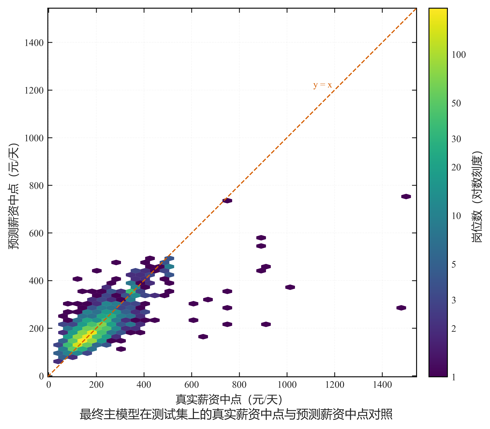

# 图 6（技能词云）与图 7（真实值—预测值对照）的论文段落

> 用途：把两张图中原属「图内注释」的文字改为正文段落，图片只保留坐标轴、参考线、色标与图题。
> 以下段落可直接粘贴进论文对应章节，数值均来自真实产物。

---

## 图 7 真实值—预测值对照（建议置于第 7.5 节「最终模型结果」，表 7-4 之后）

**图题（Word 图题行）**：图 7-x 最终主模型在测试集上的真实薪资中点与预测薪资中点对照

**正文段落**：

> 为直观展示最终主模型在测试集上的预测表现，图 7-x 以六边形分箱散点图给出 2,233 个测试岗位
> 的真实薪资中点与预测薪资中点的对应关系：横轴为真实薪资中点、纵轴为预测薪资中点，每个六边形
> 代表一个薪资网格，颜色深浅表示落入该网格的岗位数量。由于绝大多数网格的岗位计数集中在个位数，
> 图中色标采用对数刻度并标注 1、2、3、5、10、20、30、50 与 100 等刻度，使低计数网格与高计数网格
> 均可辨识（网格最大计数为 193）。虚线为 y = x 参考线，落在该线上的点表示预测值与真实值相等。
> 图中岗位大量集中于中低薪资区间并贴近参考线，说明模型在该区间的预测值与真实值整体一致；
> 随着真实薪资升高，岗位分布沿参考线的离散程度明显加大，与 7.6 节分组误差中最高薪资组误差
> 显著偏大的结果一致。该测试集上最终主模型的平均绝对误差为 35.48 元/天、均方根误差为 64.81 元/天、
> R² 为 0.582。

## 图 6 互联网 IT 实习岗位高频技能词云（建议置于第 6.2 节「主要技能特征」图 6-1 之后）

**图题（Word 图题行）**：图 6-x 互联网 IT 实习岗位高频技能词云

**正文段落**：

> 图 6-x 以词云形式补充展示技能需求的整体形态。图中词的大小表示在岗位要求中被明确提及该技能的
> 岗位数量，颜色由浅到深对应岗位数量由少到多，全图统一采用技能标准名并已合并别名（如 Python 的
> 大小写写法合并为同一词条），避免同义写法重复出现；统计范围与本章一致，即「明确要求段落」
> （REQUIREMENT_SECTION）主统计范围，分母为 8,822 个岗位，图中只呈现命中岗位数不少于 20 个的技能条目。
> 从词形分布看，编程与数据库类以 Python、SQL、Java、C++ 最为突出，技术方向类以数据分析、人工智能、
> 大模型最为突出，办公工具类以 Excel、办公软件、PPT 最为突出，与表 6-1 及图 6-1 的排名一致。
> 需要说明的是，词云只用于辅助呈现技能需求的整体结构，不替代 6.2 节的技能 Top 统计、6.3 节的
> 技能薪资差异分析与第 8.4 节的技能 SHAP 分析。

---

## 本次对两张图所做的调整

| 图 | 调整前（图内文字） | 调整后 |
| --- | --- | --- |
| 图 7 | 图内左上角标注 `n / MAE / RMSE / R²`；右下角图例框「y = x 参考线」；色标为线性 Blues，刻度自动 | 移除图内统计量与图例框；参考线改为沿对角线直接标注「y = x」；色标改为对数刻度并显式给定整数刻度，配色改为对比度更高的顺序色带 |
| 图 6 | 图内图题下方附「词大小 = 技能命中岗位数；统计范围 = 明确要求段落（REQUIREMENT_SECTION），分母 8,822 个岗位」 | 移除该注释行，图内仅保留图题；配色由 viridis 改为截断区间的高对比蓝色带，避免低频词落在接近白色的浅色 |
