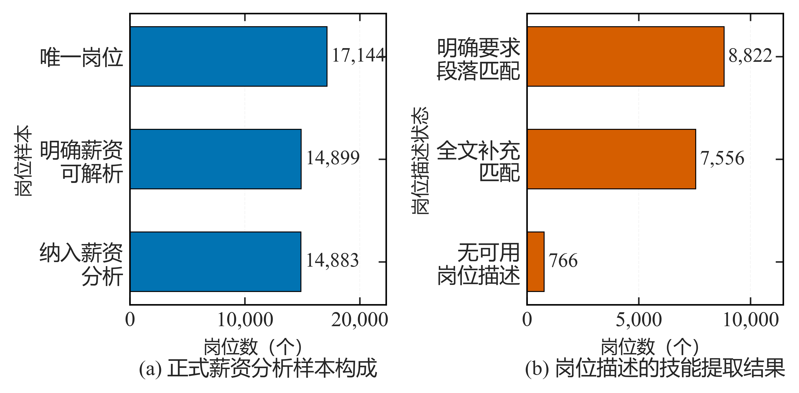
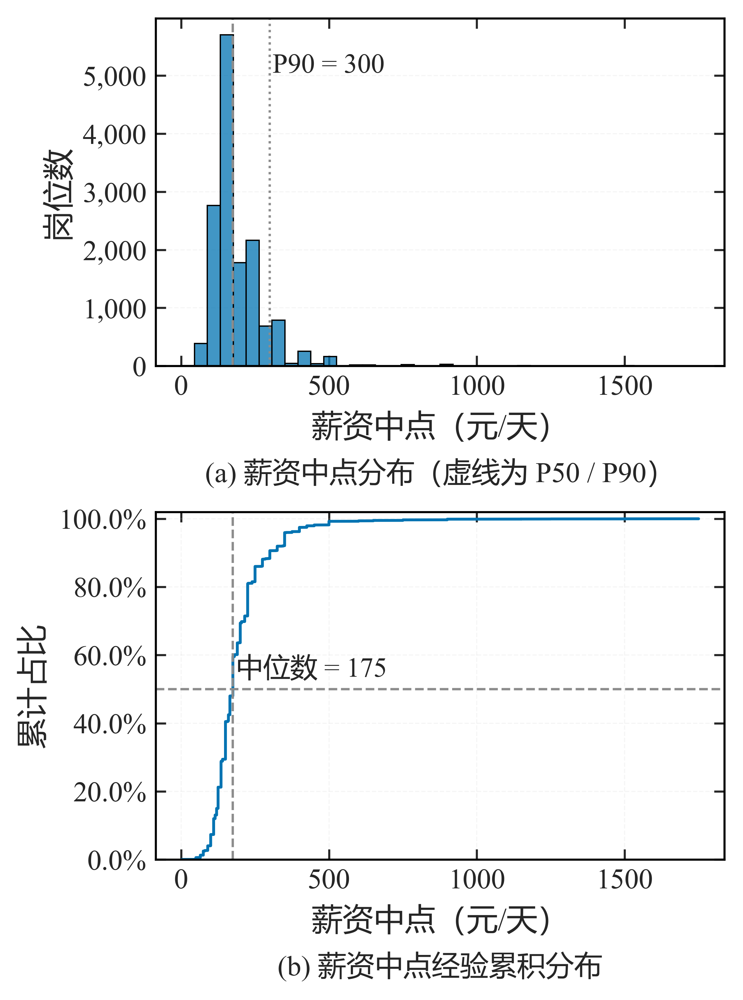

# 第 3 篇 · 数据清洗与特征工程：从问题判定到特征构建

数据清洗处理原始数据中的缺失、异常、重复与格式问题，特征工程将清洗后的字段转换为可建模的特征矩阵。本节将两者合并说明，前一部分按问题类型说明判定依据与处理方式，后一部分说明字段到特征的转换过程。

原始数据在采集与入库过程中会引入多类质量问题：字段缺失、取值范围异常、同一实体对应多条记录，以及以文本形式存储的数值字段。处理这些问题时，处理方式过强（例如直接删除含缺失或极端取值的记录）会损失有效样本并改变分布形态；处理不足则会影响后续统计与建模的可靠性。清洗完成后，字段在质量上已可用，但原始字段以业务可读的形式存储，而模型要求输入为数值型特征矩阵，二者之间仍需一次转换。

因此，本节按两个阶段展开：**清洗阶段**处理缺失值、异常值、重复值与字段规范化，并以三级校验规则收束；**特征工程阶段**按"特征派生 → 多值处理 → 时间与分箱 → 分组聚合 → 数据合并 → 特征编码 → 多源对齐"的顺序转换字段。实现基于 pandas 2.0+、NumPy 1.26+ 与 scikit-learn 1.3+，运行环境为 Python 3.10+；示例中的字段名（如 `intern_id`、`salary_raw`）取自项目实际数据表。

---


## 1 缺失值：识别与处理

### 1.1 缺失规模统计

缺失值的处理方式取决于其性质，因此第一步是统计各字段的缺失规模，再判定缺失类型。

`pandas` 提供 `isna / isnull`（二者等价）用于判定缺失，`notna / notnull` 用于判定非缺失。先做一次缺失统计，同时考察缺失数量与比例，据此定位问题集中的字段：

```python
import pandas as pd, numpy as np

df = pd.DataFrame({"年龄": [23, np.nan, 29, 40], "城市": ["北京", "上海", None, "深圳"]})
print(df.isna().sum())            # 每列缺失数
```

```text
年龄    1
城市    1
dtype: int64
```

```python
na = df.isna()
report = pd.DataFrame({"缺失数": na.sum(), "缺失率": na.mean().round(4)})
print(report.sort_values("缺失率", ascending=False))
```

### 1.2 缺失的三种类型

在掌握缺失规模之后，需进一步区分缺失的性质。将不同性质的缺失混同处理，是清洗偏差的常见来源。缺失值至少可分为三类：

| 类型 | 例子 | 处理 |
| --- | --- | --- |
| 真缺失 | 字段为空、未采集到 | 可填补（中位数 / 众数）或保留 + **缺失指示** |
| 占位符缺失 | `-`、`--`、`null`、`None`、`无`、`未知` | **先统一转成 `NaN`**，再按真缺失处理 |
| **语义缺失** | 薪资"面议"、时长"长期" | **不是缺失**：单列标识，数值列留空 |

其中占位符缺失较为隐蔽。`-`、`无`、`未知` 等取值在形式上属于有效字符串，语义上却表示缺失；若未在预处理阶段统一转换为 `NaN`，后续统计与 `dropna` 均无法正确识别：

```python
MISSING_TOKENS = {"", "-", "--", "null", "None", "nan", "无", "未知", "暂无"}

def unify_missing(df: pd.DataFrame, cols: list[str]) -> pd.DataFrame:
    df = df.copy()
    for c in cols:
        df[c] = (df[c].astype("string").str.strip()
                       .replace(list(MISSING_TOKENS), pd.NA))
    return df
```

### 1.3 处理方式：删除与填补

在明确缺失性质之后，方可选择处理方式。处理动作可分为三类：删除、填补，以及保留缺失标记。

删除适用于两类情形：仅当关键字段缺失时删除记录，仅当字段缺失比例过高时整体删除该字段。`dropna` 默认删除含缺失值的行（`axis=0`），`axis=1` 时删除列：

```python
df = df.dropna(subset=["intern_id", "detail_url"])          # 关键键缺失，删行
df = df.dropna(axis=1, thresh=int(0.6 * len(df)))           # 缺失超 40% 的列整体丢弃
```

其中 `thresh=n` 表示至少保留 n 个非缺失值，相较无参 `dropna()` 更为安全。

填补应按字段类型选择取值，避免以单一常数覆盖字段分布。数值型且分布右偏的字段宜采用**中位数**（对极端值不敏感），类别型字段宜采用**众数**：

```python
df["city"]         = df["city"].fillna(df["city"].mode().iat[0])          # 类别 → 众数
df["company_size"] = df["company_size"].fillna(df["company_size"].mode().iat[0])
df["salary_min"]   = df["salary_min"].fillna(df["salary_min"].median())   # 数值 → 中位数
```

`ffill` 与 `bfill` 分别以前一行或后一行填补，其适用前提是数据具有顺序性（时间序列或有序快照）：

```python
demo = pd.DataFrame({"年龄": [23, np.nan, 29, 40]})
print(demo.ffill())      # 前向填充：用上一行的 23
print(demo.bfill())      # 后向填充：用下一行的 29
```

对无序数据施加前向填补，等同于将上一行的取值复制到当前行，属于引入伪数据。

### 1.4 缺失指示

第三类处理是缺失指示：填补会消除"原有缺失"这一信息，通过一个 0/1 列可将其保留，供后续分析判断缺失是否与目标相关：

```python
df["city_isna"] = df["city"].isna().astype(int)      # 先记标记
df["city"]      = df["city"].fillna("未知")           # 再填补
```

---


## 2 异常值：统计离群与业务逻辑错误

异常值需区分两类情形：一是**统计离群值**，即分布上偏离主体的取值，但可能真实存在；二是**业务逻辑错误**，如薪资为负、截止日期早于发布日期。两类情形的处理方式不同：逻辑错误可以直接修正或置空，统计离群值则仅作标记，不轻易改动。

识别方法有三种，适用范围各异：

| 方法 | 适用 | 注意 |
| --- | --- | --- |
| 业务阈值（条件筛选） | 有明确取值范围（年龄 0~100、每周到岗 1~7） | 适用于有取值范围约束的字段 |
| IQR（1.5 倍四分位距） | 分布未知、偏态数据 | 反映"统计上离群"，不代表取值错误 |
| Z-score（±3σ） | 近似正态 | 对右偏数据（如薪资）不适用，会将真实高值判为异常 |

```python
def flag_outliers(s: pd.Series, k: float = 1.5) -> pd.Series:
    q1, q3 = s.quantile([0.25, 0.75]); iqr = q3 - q1
    return (s < q1 - k * iqr) | (s > q3 + k * iqr)          # 只识别，不改值
```

对统计离群值，处理方式以缩尾（将极端值压缩至分位点）为主，其优点是保留样本量并控制极端值的影响：

```python
def winsorize(s: pd.Series, p: float = 0.01) -> pd.Series:
    return s.clip(s.quantile(p), s.quantile(1 - p))          # 压到分位点，而非删除
```

区分两类情形的意义在于：可确认为逻辑错误的取值（如薪资为负）应予修正或置空；无法确认的统计离群值则仅作标记，并在后续的分布审计与缩尾敏感性分析中检验其影响。直接删除离群值会移除真实的高薪或长周期样本。

---


## 3 重复值：数据粒度与业务唯一键

重复判定与数据粒度相关。`df.drop_duplicates()` 在缺省参数下按整行完全一致去重，难以识别仅关键字段重复的记录。实际去重应基于**业务唯一键**，并按粒度分层：实体层保证一岗一行，观测层保留同一岗位的最新观测。

```python
df = df.drop_duplicates(subset=["intern_id"])                       # 实体层：一岗一行

df = (df.sort_values("observed_at")
        .drop_duplicates(subset=["intern_id", "detail_url"], keep="last"))  # 观测层：保留最新
```

同一岗位在不同时间被多次抓取时，`intern_id` 与 `detail_url` 均相同，仅观测时间不同。两个层次的去重目的不同，均需执行。

---


## 4 字段规范化

### 4.1 文本字段数值化

字段规范化将可读文本转换为可计算数值，是清洗中耗时较多的环节。

薪资字段的格式并不统一（如 `150-200`、`200`、`100-150元/天`），其中"薪资面议"应按**语义缺失**处理，而非赋值为 0：

```python
def parse_salary(col: pd.Series):
    col = col.fillna("")
    negotiable = col.isin(["薪资面议", "", "nan", "None"]).astype(int)   # 面议 ≠ 0 元
    clean = col.str.replace("/天", "", regex=False)
    rng = clean.str.extract(r"(\d+)-(\d+)").astype(float)                # 100-200 → 上下限
    single = clean.str.extract(r"^(\d+)$").astype(float)                 # 150 → 上下限同值
    return negotiable, rng[0].combine_first(single[0]), rng[1].combine_first(single[1])
```

对于时长、天数等含单位的文本字段，抽取首个数值即可：

```python
def parse_first_number(s: pd.Series) -> pd.Series:
    return pd.to_numeric(s.astype("string").str.extract(r"(\d+)")[0], errors="coerce")
```

### 4.2 派生 → 核验 → 删除原字段

规范化不宜直接覆盖原字段，而应按"派生 → 核验 → 删除原字段"的顺序进行，以保证结果可回溯。派生得到新列后，通过抽样对账核验解析结果能否反查回原文本，核验通过再删除原字段：

```python
# 1) 派生：从原始薪资文本解析出数值列
df["salary_negotiable"], df["salary_min"], df["salary_max"] = parse_salary(df["salary_raw"])

# 2) 核验：抽样对账——解析后的数值必须能反查到原文本
check = df.dropna(subset=["salary_min"]).sample(20, random_state=42)
assert check.apply(_traceable, axis=1).all(), "存在无法反查的解析结果"

# 3) 删原列：核验通过后，宽表只保留规范列（原文本另行留档）
df = df.drop(columns=["salary_raw"])
```

---


## 5 数据校验：三级校验规则

清洗规则若仅依赖实现者的记忆，难以复核与复用。可将规则划分为类型、取值域与跨字段逻辑三个层级，逐层校验并统计违规数量：**L1 类型 → L2 取值域 → L3 跨字段逻辑**。

三个层级的含义与作用如下：L1 负责类型转换，将无法转为数值的取值置为缺失；L2 约束取值域，将超出合法范围的取值置空；L3 校验跨字段逻辑，仅作标记而不修改取值。函数在返回处理结果的同时输出清洗报告，记录各层级的违规数量：

```python
def clean_and_validate(df: pd.DataFrame) -> tuple[pd.DataFrame, dict]:
    report = {"rows_in": len(df), "issues": {}}
    out = df.copy()
    # L1 类型
    out["salary_min"] = pd.to_numeric(out["salary_min"], errors="coerce")
    out["salary_max"] = pd.to_numeric(out["salary_max"], errors="coerce")
    # L2 取值域
    out["days_per_week"] = pd.to_numeric(out["days_per_week"], errors="coerce")
    out.loc[~out["days_per_week"].between(1, 7), "days_per_week"] = np.nan
    out.loc[~out["degree"].isin({"不限", "大专", "本科", "硕士", "博士"}), "degree"] = None
    # L3 逻辑（只标记，不静默修补）
    out["salary_anomaly"] = np.where(
        out["salary_min"].notna() & out["salary_max"].notna()
        & ((out["salary_min"] <= 0) | (out["salary_max"] <= 0) | (out["salary_min"] > out["salary_max"])),
        "非正数或上下限倒置", "")
    report["issues"]["salary_anomaly"] = int((out["salary_anomaly"] != "").sum())
    return out, report
```

校验结果以报告形式留痕，用于核对各层级的问题数量。对关键字段，解析成功率应达到较高水平（项目中薪资解析成功率在 95% 以上），低于该水平时应检查解析规则本身。

---


## 6 特征派生与 schema 登记

清洗之后的字段进入特征工程阶段。特征派生即由已有字段计算新字段。单个派生操作较为直接，但派生字段增多后容易出现来源不清、口径不一致的问题。为便于追溯，派生按四步进行，并记录字段元信息：

```text
派生(derive) → 核验(verify) → 删原列(drop) → 登记 schema(manifest)
```

以薪资字段为例，由上下限派生出中点与区间宽度，并在派生后核验缺失比例：

```python
def derive_salary(df: pd.DataFrame) -> pd.DataFrame:
    df = df.copy()
    df["salary_mid"]  = (df["salary_min"] + df["salary_max"]) / 2     # 派生
    df["salary_span"] = df["salary_max"] - df["salary_min"]
    assert df["salary_mid"].isna().mean() < 0.05 or df["salary_min"].isna().all()   # 核验
    return df
```

schema 登记用于记录每个输出字段的类型、是否入模与含义，作为字段口径的统一来源：

```python
COLUMN_SPEC = {
    "salary_mid": ("float",   False, "主目标，禁止进入 X"),   # (类型, 是否入模, 说明)
    "degree":     ("category", True,  "学历要求"),
    "job_tags":   ("list",     False, "多值：建模阶段 multi-hot"),
}
```

登记项中的"是否入模"用于区分特征与目标：目标字段（如 `salary_mid`）标记为不入模，避免其作为特征进入模型。

---


## 7 多值字段与多值编码

多值字段指单条记录对应多个取值的字段，例如一个岗位对应多个技能标签。若为每个标签单独建列，字段数量会随取值数量增长；更合适的做法是将其展开为 long-format，即一行对应"一个实体与一个取值"的对应关系：

```python
df["job_tags"] = df["job_tags_detail"].fillna("").str.split("、")
membership = (df.explode("job_tags")[["job_id", "job_tags"]]
                .rename(columns={"job_tags": "skill"}))
```

```text
job_id  skill
0   J001   Python
0   J001   MySQL
1   J002   Java
```

该形式的两个用途：一是可直接统计各技能的出现频次；二是建模阶段可按出现阈值筛选后 pivot 为 multi-hot 向量，既能控制特征维度，也保留了技能之间的共现关系。

---


## 8 时间处理与分箱

时间字段应先解析为 `datetime`，再按分析需要派生粒度：

```python
df["publish_time"]  = pd.to_datetime(df["publish_time"], errors="coerce")
df["publish_month"] = df["publish_time"].dt.to_period("M").astype(str)
df["publish_hour"]  = df["publish_time"].dt.hour
```

连续数值常需离散化，pandas 提供两种方式，区别在于切分依据：

- `cut`：按**业务阈值**切分，各区间宽度由取值决定；
- `qcut`：按**分位点**切分，各区间样本量相近，适用于分组对比。

```python
df["salary_level"]    = pd.cut(df["salary_mid"], [0, 100, 200, 400, float("inf")],
                               labels=["低", "中", "较高", "高"])
df["salary_quartile"] = pd.qcut(df["salary_mid"], 4, labels=False)   # 等频
```

当分组结果需按业务含义解释时使用 `cut`；当分组用于比较且需避免某组样本过少时使用 `qcut`。

---


## 9 分组聚合与数据合并

### 9.1 分组聚合：agg 与 transform

`groupby` 用于按类别聚合数值。使用时需区分 `agg` 与 `transform`：前者对每组输出一行（降维汇总），后者保持原行数并将组内统计量广播回原表，因而可直接作为特征：

```python
df = pd.DataFrame({"岗位": ["A", "A", "B", "B", "C"], "薪资": [100, 150, 200, 250, 300]})
print(df.groupby("岗位")["薪资"].mean())
```

```text
岗位
A    125.0
B    225.0
C    300.0
Name: 薪资, dtype: float64
```

```python
df["岗位均值"] = df.groupby("岗位")["薪资"].transform("mean")   # 行数不变，可作特征
```

### 9.2 合并与拼接：merge 与 concat

`merge` 按连接键合并两张表。其常见问题是**行数放大**：当右表的连接键存在重复时，左表每一行将匹配出多条记录，结果表随之膨胀。因此合并前应先校验右表键的唯一性，并在合并后核对行数：

```python
def safe_merge(left: pd.DataFrame, right: pd.DataFrame, on, how: str = "left") -> pd.DataFrame:
    dup = int(right.duplicated(subset=on).sum())
    assert dup == 0, f"右表键有 {dup} 条重复，merge 会放大行数"
    n0 = len(left)
    merged = left.merge(right, on=on, how=how)
    assert len(merged) == n0 if how == "left" else True
    return merged
```

`concat` 用于行列方向的拼接（多批次、多来源、结构相同的数据），不涉及键校验：

```python
df_all = pd.concat([df_2024, df_2025], ignore_index=True)     # 纵向堆叠
```

`concat` 仅作拼接、不检查键关系；需要按键匹配时应改用 `merge`。

---


## 10 特征编码与多源对齐

类别与多值特征需编码为数值向量，常用 OneHot 编码。编码环节需注意拟合数据的范围：编码器只在训练集上拟合，再作用于验证集与测试集，否则编码器会引入测试集信息，导致评估结果偏乐观：

```python
from sklearn.preprocessing import OneHotEncoder
enc = OneHotEncoder(handle_unknown="ignore")
enc.fit(train[["degree"]])            # 只在训练集拟合
X_train = enc.transform(train[["degree"]])
X_valid = enc.transform(valid[["degree"]])     # 用同一编码器
```

`handle_unknown="ignore"` 用于处理推理阶段出现的、训练集中未见过的类别取值。多值字段的 multi-hot 编码遵循同一原则，阈值与列集合同样在训练集上确定。

合并来自不同来源的数据前，需依次完成四项对齐：

| 步骤 | 做法 |
| --- | --- |
| 键规范化 | 去空格、全半角统一（低风险归一化） |
| 粒度对齐 | 统一到同一粒度再连 |
| 时序对齐 | **as-of join**（`pd.merge_asof`），只取"当时可得" |
| 连接语义 | 明确 `how` 与唯一键 |

其中时序对齐用于避免引入未来信息：对每条观测匹配"截至该时点最新"的画像，而不是匹配全期最新的画像：

```python
# as-of：给每条观测匹配"截至该时点最新"的画像，避免引入未来信息
merged = pd.merge_asof(left.sort_values("ts"), right.sort_values("ts"),
                       on="ts", by="company_id", direction="backward")
```

---


## 11 项目结果

**图 1** 为正式薪资分析样本的构成与岗位描述处理结果：

```python
# 来源：scripts/ch4_lifecycle/08_figures.py
import matplotlib.pyplot as plt

overview = _read('ch4/21_eda_statistical_analysis.xlsx', '01_样本概况').set_index('指标')['数值']
scope = _read('ch6/19_skill_eda_scope_audit.xlsx', '01_样本统计范围').set_index('统计范围')
values_a = [int(overview['全量岗位数（EDA 分析单元）']),
            int(overview['正式薪资分析样本']) + int(overview['薪资逻辑异常岗位数']),
            int(overview['正式薪资分析样本'])]
values_b = [int(scope.loc['REQUIREMENT_SECTION', '岗位数']),
            int(scope.loc['FULL_TEXT_FALLBACK', '岗位数']),
            int(scope.loc['EMPTY_TEXT', '岗位数'])]

fig, axes = plt.subplots(1, 2, figsize=(_w(15.5), 3.2))
ax = axes[0]
labels = ['唯一岗位', '明确薪资\n可解析', '纳入薪资\n分析']
positions = np.arange(len(labels))[::-1]
ax.barh(positions, values_a, height=0.58, color=plot_style.MAIN_COLOR,
        edgecolor='black', linewidth=0.5)
ax.set_yticks(positions)
ax.set_yticklabels(labels)
span = float(max(values_a))
for position, value in zip(positions, values_a):
    ax.text(value + span * 0.02, position, f'{value:,}', va='center', ha='left',
            fontsize=plot_style.FONT_SIZES['annotation'])
ax.set_xlim(0, span * 1.30)
ax.set_xlabel('岗位数（个）')
ax.set_ylabel('岗位样本')
plot_style.apply_sci_axis(ax, grid_axis='x')
plot_style.format_integer_axis(ax, axis='x')
plot_style.add_subfigure_caption(ax, 'a', '正式薪资分析样本构成')

ax2 = axes[1]
labels2 = ['明确要求\n段落匹配', '全文补充\n匹配', '无可用\n岗位描述']
positions2 = np.arange(len(labels2))[::-1]
ax2.barh(positions2, values_b, height=0.58, color=plot_style.ACCENT_COLOR,
         edgecolor='black', linewidth=0.5)
ax2.set_yticks(positions2)
ax2.set_yticklabels(labels2)
span2 = float(max(values_b))
for position, value in zip(positions2, values_b):
    ax2.text(value + span2 * 0.02, position, f'{value:,}', va='center', ha='left',
             fontsize=plot_style.FONT_SIZES['annotation'])
ax2.set_xlim(0, span2 * 1.30)
ax2.set_xlabel('岗位数（个）')
ax2.set_ylabel('岗位描述状态')
plot_style.apply_sci_axis(ax2, grid_axis='x')
plot_style.format_integer_axis(ax2, axis='x')
plot_style.add_subfigure_caption(ax2, 'b', '岗位描述的技能提取结果')
fig.subplots_adjust(left=0.135, right=0.985, bottom=0.30, top=0.965, wspace=0.55)
plt.show()
```



左图给出进入薪资分析的样本构成：从 **17,144** 个唯一岗位实体出发，**14,899** 个岗位的薪资可明确解析，扣除逻辑异常的 **16** 个后，得到 **14,883** 个正式薪资样本；另有 **2,245** 个岗位薪资为"面议"，按语义缺失以单列标识，未置为 0，因此不进入薪资分析样本。右图给出岗位描述形成技能信息的比例，对应文本侧的清洗与可用性判定。

**图 2** 为薪资中点的分布与经验累积分布（n = 14,883）：

```python
# 来源：scripts/figures/base/01_eda_modeling_figures.py
stats = table(TABLE_29, '02_薪资描述统计').set_index('指标')['数值']
median = float(stats['中位数'])
p90 = float(stats['P90'])
values = pd.read_parquet(project_paths.PROCESSED_DIR / 'job_salary_model_dataset.parquet',
                         columns=[SALARY_COLUMN])[SALARY_COLUMN].dropna().to_numpy()

fig, axes = plt.subplots(1, 2, figsize=_size(layout, 8.2, 4.2))
ax = axes[0]
plot_style.hist_discrete(ax, values, discrete=False, bins=40,
                         xlabel=SALARY_LABEL, ylabel='岗位数')
ax.axvline(median, color=plot_style.MUTED_COLOR, linestyle='--', linewidth=0.9)
ax.axvline(p90, color=plot_style.MUTED_COLOR, linestyle=':', linewidth=0.9)
plot_style.apply_sci_axis(ax, grid_axis='y')
plot_style.format_integer_axis(ax, axis='y')
top = ax.get_ylim()[1]
ax.text(p90 * 1.03, top * 0.90, f'P90 = {p90:,.0f}', ha='left', va='top',
        fontsize=plot_style.FONT_SIZES['annotation'])
plot_style.add_subfigure_caption(ax, 'a', '薪资中点分布（虚线为 P50 / P90）')

ax2 = axes[1]
ordered = np.sort(values)
ecdf = np.arange(1, len(ordered) + 1) / len(ordered)
ax2.plot(ordered, ecdf, color=plot_style.MAIN_COLOR, linewidth=1.1)
ax2.axhline(0.5, color=plot_style.MUTED_COLOR, linestyle='--', linewidth=0.9)
ax2.axvline(median, color=plot_style.MUTED_COLOR, linestyle='--', linewidth=0.9)
ax2.text(median * 1.06, 0.52, f'中位数 = {median:,.0f}', ha='left', va='bottom',
         fontsize=plot_style.FONT_SIZES['annotation'])
ax2.set_xlabel(SALARY_LABEL)
ax2.set_ylabel('累计占比')
ax2.set_ylim(0, 1.02)
plot_style.apply_sci_axis(ax2)
plot_style.format_percent_axis(ax2, axis='y')
plot_style.add_subfigure_caption(ax2, 'b', '薪资中点经验累积分布')
_adjust(fig, layout, left=0.11, wspace=0.30, bottom=0.32)
plt.show()
```



薪资中点**中位数为 175 元/天，均值为 192.87**（均值高于中位数，与右偏分布一致），IQR 为 90，P10 与 P90 分别为 110 与 300。分布呈明显右偏并带长尾。这一形态说明：长尾对应真实存在的高薪岗位，若按 IQR 直接删除会破坏分布结构；处理方式为对极端值作缩尾并保留标记，同时在稳健性实验中比较缩尾前后的结果差异。

---


## 12 小结

原始数据的质量问题可分为缺失、异常、重复与格式四类，处理方式取决于问题的性质而非统一规则：缺失值需先区分真缺失、占位符缺失与语义缺失，占位符先归一为 `NaN`，语义缺失以单列标识；填补按字段类型选择统计量，并以缺失指示列保留原有缺失信息。异常值需区分统计离群值与业务逻辑错误，前者以缩尾和标记处理，后者可直接修正或置空。去重以业务唯一键为依据，并区分实体层与观测层。字段规范化按"派生 → 核验 → 删除原字段"进行，以保证可回溯。上述规则以类型、取值域与跨字段逻辑三个层级组织，校验结果以报告留痕。

字段到特征的转换包含若干相互衔接的步骤：派生新字段并按"派生 → 核验 → 删除原字段 → schema 登记"记录口径；多值字段展开为 long-format，建模阶段按阈值转为 multi-hot；时间字段解析后按业务阈值（`cut`）或分位点（`qcut`）分箱；分组聚合区分 `agg` 与 `transform`，后者可用于构造特征。合并前需校验右表键的唯一性，避免行数放大；编码器只在训练集上拟合，以保证评估结果不受测试集信息影响；多源数据在键、粒度与时序三个层面完成对齐，其中时序对齐使用 as-of join 以避免引入未来信息。

---


## 13 延伸参考

- 相关文章：[5. Pandas 缺失值与异常值处理](https://blog.csdn.net/MoRanzhi1203/article/details/152464721)、[7. Pandas 字符串与类别数据处理](https://blog.csdn.net/MoRanzhi1203/article/details/152522596)、[10. Pandas 分组与聚合分析（groupby）](https://blog.csdn.net/MoRanzhi1203/article/details/152565805)、[11. Pandas 数据分类与区间分组（cut 与 qcut）](https://blog.csdn.net/MoRanzhi1203/article/details/152612785)、[12. Pandas 数据合并与拼接（concat 与 merge）](https://blog.csdn.net/MoRanzhi1203/article/details/152663041)、[15. Pandas 综合实战案例（零售数据分析）](https://blog.csdn.net/MoRanzhi1203/article/details/152663971)；


上一篇：[02 数据采集与存储](./第 2 篇 · 数据采集与存储：请求控制、任务调度与格式选择.md) ｜ 下一篇：[04 文本处理与信息抽取](./第 4 篇 · 文本处理与信息抽取：语料构建与技能抽取.md)


