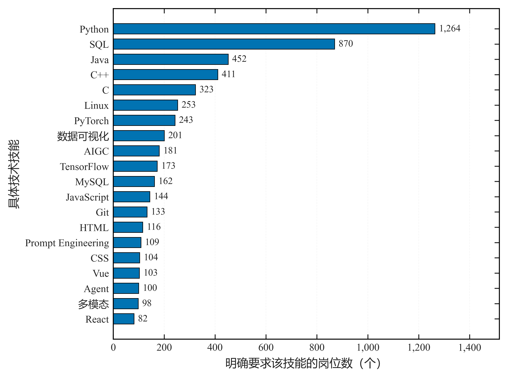
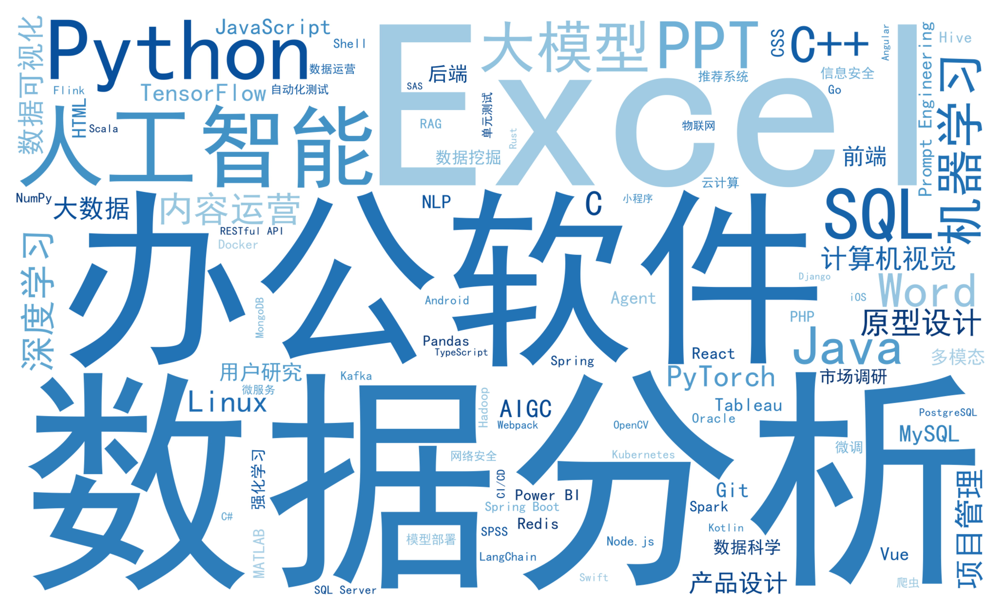

# 第 4 篇 · 文本处理与信息抽取：语料构建与技能抽取

文本数据需先清洗并区分语料版本，再向量化后入模；同时其中包含的技能与公司名称等对象需抽取为结构化字段。本节将文本处理与信息抽取合并说明，前者构建可用语料，后者从语料中识别结构化对象。

前几节处理的对象均为结构化字段（数值、类别、时间），字段的取值可直接参与计算。岗位描述（JD）属于长文本：信息密度高、格式不统一，且往往包含与预测目标直接相关的信息。例如当预测目标为薪资时，岗位描述中的薪资数字即是目标的直接表述。

因此文本环节包含两项工作：一是构建可用语料，按用途区分版本并移除特征文本中的目标信息，随后向量化；二是抽取结构化对象，从文本中识别技能与公司实体并整理为字段，使其可参与分组统计与特征构造。本节按"文本清洗与语料版本 → 目标信息处理 → 文本分段 → 向量化 → 截断审计与缓存 → 信息抽取 → 技能词典与匹配 → 结构化输出 → 公司实体标准化 → 项目结果"的顺序展开。实现基于 scikit-learn 1.3+（TF-IDF）、sentence-transformers 2.5+（句向量，可选依赖 torch 2.0+）与 pyyaml 6.0+（词典配置）；运行环境为 Python 3.10+、pandas 2.0+，分词可选 jieba 0.42+。

---


## 1 文本清洗与语料版本

文本清洗对原始文本施加低风险操作：去除 HTML 注释与标签、统一全半角、压缩空白。这些操作不改变文本语义，仅规范格式：

```python
import re
def clean_text(s: str) -> str:
    s = re.sub(r"<!--.*?-->", "", s, flags=re.S)      # 去 HTML 注释
    s = re.sub(r"<[^>]+>", " ", s)                     # 去 HTML 标签
    s = s.replace("（", "(").replace("）", ")")          # 全角括号 → 半角
    return re.sub(r"\s+", " ", s).strip()              # 压缩空白
```

清洗以新增列的方式输出，不覆盖原始文本。原始文本在后续环节中仍需用于复核清洗与去泄漏的改动幅度，若覆盖则无法回溯。

同一份文本在项目中承担不同用途，按用途保存为多个版本，可避免用途之间的干扰：

| 版本 | 用途 | 处理 |
| --- | --- | --- |
| 原始 | 留档 / 复核 | 0 |
| 清洗版 | 展示 / 审计 | 低风险清洗 |
| 语义分析版 | 完整统计范围 | 清洗 |
| **模型安全版** | **建模输入** | 清洗 + **移除目标泄漏** |

其中前三个版本保留完整的文本内容，仅用于留档、展示与统计；模型安全版用于建模输入，在清洗版的基础上移除目标相关信息。

---


## 2 目标信息处理

目标泄漏指特征中包含可直接推断目标的信息。在薪资预测任务中，岗位描述常直接写明薪资范围（如"150-200元/天"），若该文本作为特征输入模型，模型可通过识别数字直接给出预测值，无需依赖其他特征。此时模型在测试集上的表现会明显优于真实预测能力。

处理方式是用正则匹配薪资样式并替换为占位符：

```python
SALARY_PAT = re.compile(r"\d+\s*[-~]\s*\d+\s*元?\s*/?\s*(天|日|月|年)?|\d+\s*元?\s*/?\s*(天|日)")

def to_model_safe(text: str) -> str:
    return re.sub(r"\s+", " ", SALARY_PAT.sub(" [薪资] ", text)).strip()
```

```python
print(to_model_safe("薪资 150-200元/天，坐标北京"))
```

```text
薪资 [薪资] ，坐标北京
```

处理之后需度量改动幅度，以确认移除的范围符合预期。度量分两类指标：**字面**指标包括字符数、词数与 Jaccard 相似度，**语义**指标包括 TF-IDF 余弦与句向量余弦：

```python
def jaccard(a, b) -> float:
    sa, sb = set(a), set(b)
    return len(sa & sb) / len(sa | sb) if (sa | sb) else 1.0
```

度量在**两个统计范围**上分别进行：完整统计范围（语义分析版）与去薪资范围（模型安全版）。主判据采用去薪资版，两组结果之差用于诊断。显著性阈值由真实分布的 P50 / P75 / P90 / P95 确定，而非取固定常数，以适应不同语料的分布。若句向量模型不可用，相关指标标记为 `NOT_RUN` 并降级，不以 TF-IDF 余弦替代深层语义指标。

---


## 3 文本分段

分段用于定位文本中的有效信息。岗位描述各段落的技能信号密度差异明显："任职要求"段以技术栈为主，"岗位职责"段以流程描述为主。按此规律切分出"要求 / 职责 / 加分"等段落，可为后续的技能抽取提供优先级：先在信号密集的段落内匹配，未命中者再退回全文检索。

```python
SECTION_PATTERNS = {
    "要求": r"(任职要求|岗位要求|任职资格|我们希望你)",
    "职责": r"(岗位职责|工作内容)",
    "加分": r"(加分项|优先考虑)",
}
def split_sections(text: str) -> dict:
    ...   # 按上面的正则切段，返回 {"要求": ..., "职责": ..., "加分": ...}
```

「要求」段的技能信号最密集，因此抽取时先在该段匹配，再以全文作为补充范围，以降低漏抽比例。

---


## 4 向量化

文本需向量化后方可入模。向量化有两条路线，区别在于表示能力与计算成本：

- **TF-IDF**：基于词频统计，速度快、结果可解释，但仅反映词面共现，无法表达近义关系；
- **句向量（BGE 等）**：由预训练模型将整句编码为稠密向量，可表达语义相近但用词不同的文本，代价是需要模型推理，计算成本高于 TF-IDF。

```python
from sklearn.feature_extraction.text import TfidfVectorizer

tfidf = TfidfVectorizer(max_features=20000)
X = tfidf.fit_transform(docs)               # 词面向量

from sentence_transformers import SentenceTransformer
model = SentenceTransformer("BAAI/bge-small-zh-v1.5")
emb = model.encode(docs, normalize_embeddings=True, batch_size=64)   # 深层语义向量
```

两条路线可结合使用：TF-IDF 用于关键词与稀疏特征，句向量用于需要语义匹配的场景（如公司简介与岗位描述的相似度）。

---


## 5 截断审计与缓存

句向量模型设有最大输入长度，超出部分将被截断。截断率若未报告，则无法判断有多少文本信息未被编码，因此需使用模型自身的 tokenizer 实测：

```python
lens = [len(model.tokenizer.encode(d, truncation=False)) for d in docs]
truncation_rate = sum(l > model.max_seq_length for l in lens) / len(lens)   # 真实的截断比例
```

以字符数近似 token 数会低估长度，截断率应与模型的最大长度配置对应，故直接调用 tokenizer 计算。

向量化的结果需可复现，为此引入缓存：缓存键由文本类型、语料 SHA256 与模型配置组成，任一输入变化都会改变缓存键，使旧结果失效：

```python
import hashlib
def corpus_sha256(texts) -> str:
    h = hashlib.sha256()
    for t in texts:
        h.update(str(t).encode())
    return h.hexdigest()
```

向量存储于 `features/*.npz`，宽表仅保留"文本向量行号"引用，避免宽表随向量维度膨胀；模型安全版与语义分析版使用同一编码器，因此安全版可直接复用完整版向量，仅需对含薪资的文本重新编码。

---


## 6 信息抽取的方法选择

语料准备完毕后，进入结构化对象的抽取。抽取对象主要有两类：一是**技能**，即岗位描述中出现的 `Python`、`MySQL`、`Docker` 等技术项；二是**公司实体**，即把同一公司的多种写法归并为同一实体。

抽取的实现方式主要有两类：基于词典与规则的方法，以及基于预训练模型的命名实体识别（NER）方法。二者的适用条件不同：

| 维度 | 词典 / 规则 | NER 模型 |
| --- | --- | --- |
| 可解释性 | 命中可追溯至具体规则与位置 | 输出为模型预测，需额外解释 |
| 覆盖率 | 受限于词典范围，词典外术语无法识别 | 可识别未见过的表述 |
| 维护方式 | 增删词项、调整规则 | 需标注数据与训练 |
| 适用场景 | 词表规模有限、要求可审计 | 表述多样、难以穷举 |

技能名称属于相对封闭的集合（数百至数千项），且抽取结果需要可审计，因此采用词典与规则方法为主。以一个常见写法为例：

```python
if skill.lower() in text.lower():   # 错误：会把 C 命中到 C++ / CPU / City，R 命中任意英文词组
    ...
```

`in` 属于**包含匹配**：`C` 会误匹配 `C++`、`CPU`、`City`，`R` 会匹配任意含字母 r 的字符串。因此，规则方法需先解决短词的歧义问题。

---


## 7 技能词典结构

技能词典采用三级结构组织，并将各类别名统一至一个规范名（canonical）：

```text
feature_family（技能族）→ group（技能组）→ canonical（规范名）
```

三个层级的含义为：技能族表示技术领域（如后端、数据），技能组表示领域内的类别，规范名表示具体技能的标准写法。同一技能的不同写法（如 `cpp`、`c++`、`C++`）通过别名表映射到同一规范名，从而使后续统计不受写法的差异影响。

```python
from dataclasses import dataclass

@dataclass
class SkillConfig:
    alias_to_skill: dict          # 别名 → 规范名（含 cpp→C++、ML→机器学习）
    alias_group: dict
    strict_case_aliases: set      # 需要"大小写严格"的别名（如 C、R、Go）
    blocklist: list               # 上下文黑名单（出现则放弃该命中）
    short_term_max_length: int
    context_window: int = 30
```

词典以配置文件形式维护（`config/skills.yml`），增删词项与调整别名不改动代码。

---


## 8 匹配规则与短词歧义

### 8.1 别名重叠与漏抽

匹配规则需处理两类问题：别名之间的重叠，以及文本篇幅带来的漏抽。

**别名重叠**通过匹配顺序解决：按别名长度降序依次匹配，较长的别名先命中并占用文本位置，从而避免被较短的别名截取。例如 `C++`、`C#` 先于 `C` 匹配，命中后其位置不再被 `C` 重复占用：

```python
for alias in sorted(alias_to_skill, key=len, reverse=True):   # C++ / C# 先于 C
    ...
```

**漏抽**通过匹配范围解决：先在第 3 节切分的「要求 / 技能 / 加分」段落内匹配；若段落内未识别到，再将匹配范围扩展至全文，以降低漏抽比例。

### 8.2 短词的三项约束

对 `C / R / Go / AI / ML / DL / CV` 等长度较短的术语，仅设词边界不足以排除误匹配，需三项条件同时成立：

1. **大小写严格**：`C` 仅匹配大写 `C`；
2. **词边界**：左右不能为字母 / 数字 / `_+#`；
3. **黑名单**：上下文窗口内若出现"City、CPU"等词，则放弃该命中。

词边界的判定与实现如下：

```python
BOUNDARY_CHARS = set("abcdefghijklmnopqrstuvwxyzABCDEFGHIJKLMNOPQRSTUVWXYZ0123456789_+#")

def is_boundary(text: str, start: int, end: int) -> bool:
    left  = text[start - 1] if start > 0 else ""
    right = text[end] if end < len(text) else ""
    return left not in BOUNDARY_CHARS and right not in BOUNDARY_CHARS

import re
pat = re.compile(r"(?<![A-Za-z0-9_+#])C(?![A-Za-z0-9_+#])")   # 严格词边界的 C
print(pat.findall("C C++ C# CPU"))
```

```text
['C']
```

`C++`（后跟 `+`）、`C#`（后跟 `#`）、`CPU`（后跟 `P`）均因右侧字符属于边界字符集而被排除，仅独立的 `C` 命中。

---


## 9 结构化输出与公司实体标准化

### 9.1 结构化输出

抽取结果以 long-format 输出，一行对应一个实体与一个技能：

```python
rows = []
for job_id, text in texts.items():
    for canonical in extract_skills(text):
        rows.append({"job_id": job_id, "canonical_skill": canonical, "match_scope": scope})

membership = pd.DataFrame(rows)     # 一行 = 一实体 × 一技能
```

该形式便于按技能统计出现频次，也便于在建模阶段按阈值 pivot 为 multi-hot（见第 3 篇）。字段 `match_scope` 记录命中所处的段落范围，用于区分"要求"段命中与全文补充命中。

### 9.2 公司实体标准化

公司名称由人工录入，同一公司存在多种写法（如全称、简称、含地域后缀）。实体标准化将这些写法归并为同一实体，归并依据为高置信映射：

| 映射依据 | 是否进入正式时序 |
| --- | --- |
| 名称完全一致 / 同名同地 / 人工别名 | 进入 |
| 同名跨地域 / 低置信 / 未解析 | 暂不进入，转人工复核 |

名称仅作低风险归一化（去空格、全半角统一），不进行模糊合并。同名跨地域的实体标记为 `AMBIGUOUS` 并转人工确认，因错误合并会将不同公司的数据混为一条，其修正成本高于暂不合并。

---


## 10 项目结果

技能抽取的结果可直接用于统计技能需求分布。**图 1** 为项目从 **8,822** 个含技能文本的岗位中抽取并统计的**核心技术技能需求 Top20**：

```python
# 来源：scripts/figures/base/01_eda_modeling_figures.py
demand = table(TABLE_29, '07_技能需求')
frame = demand[demand['榜单'].str.startswith('核心技术技能')].head(20)
series = frame.set_index('技能标准名')['岗位数']

fig, ax = plt.subplots(figsize=_size(layout, 7.4, 5.6))
plot_style.barh_ranked(ax, series, xlabel='明确要求该技能的岗位数（个）',
                       ylabel='具体技术技能')
ax.set_xlim(0, float(series.max()) * 1.20)
plot_style.apply_sci_axis(ax, grid_axis='x')
plot_style.format_integer_axis(ax, axis='x')
plt.show()
```



榜单反映了样本中需求量最高的技术项，集中在通用编程语言与数据相关技术上。该榜单同时可用于核对抽取质量：若短词（C / R / Go）的误匹配未被排除，或长别名被短别名截取（`C++` 被计为 `C`），榜单构成将出现明显异常。抽取结果以 long-format 入库，后续在建模阶段按阈值 pivot 为 multi-hot。

**图 2** 为同一技能统计范围下的**高频技能词云**（仅保留岗位数 ≥ 20 的词条，共 97 个）：

```python
# 来源：scripts/supplementary/01_completion_supplement.py
ranks = pd.read_excel(TABLES_DIR / 'ch6/19_skill_eda_scope_audit.xlsx',
                       sheet_name='02_主统计范围技能排名')
counts = {str(name): int(count) for name, count in
          zip(ranks['技能标准名'], ranks['岗位数']) if int(count) >= 20}

font = Path(r'C:\Windows\Fonts\simhei.ttf')
cmap = mcolors.LinearSegmentedColormap.from_list(
    'blues_readable', plt.cm.Blues(np.linspace(0.35, 1.0, 256)))
cloud = WordCloud(font_path=str(font), width=2000, height=1200,
                  background_color='white', colormap=cmap,
                  prefer_horizontal=0.9, max_words=200, random_state=SEED,
                  margin=6).generate_from_frequencies(counts)

fig, ax = plt.subplots(figsize=(10.0, 6.4))
ax.imshow(cloud, interpolation='bilinear')
ax.axis('off')
plt.show()
```



词云与图 1 的 Top20 条形图取自同一张技能排名表（技能主统计范围，分母 8,822），并非两批数据，两者用途不同：条形图用于读取具体频次与排名，也可用于核对抽取质量；词云用于呈现抽取所得的技能词表规模与整体分布，例如 97 个词条中既有高频的通用编程语言，也有仅略高于阈值的细分技术项。需注意词云以面积与字号编码，不能用于读数或组间比较，涉及具体数值的结论仍以条形图与表格为准；词的大小反映出现频次，不代表重要性权重。

---


## 11 小结

文本环节与结构化字段处理的主要差异在于信息形态。语料方面，长文本需先清洗格式、再按用途区分版本；语料分为原始、清洗、语义分析与模型安全四类，其中模型安全版用于建模输入，其目标泄漏以正则移除，并以字面与语义两类指标、在两个统计范围上度量改动幅度。分段用于定位技能信号密集的段落，"要求"段优先匹配、全文补充；向量化可在 TF-IDF 与句向量之间选择，前者侧重词面统计，后者侧重语义表示；截断率以模型 tokenizer 实测，缓存键由文本、语料与模型配置共同确定以保证可复现。

抽取方面，方法选择依据是词表规模与可解释性要求：技能名称集合相对封闭且结果需要可审计，因此以词典与规则方法为主，模型方法作为补充召回。词典按技能族、技能组与规范名三级组织，别名统一映射至规范名。匹配过程中，按别名长度降序匹配以避免重叠，按段落优先、全文补充以控制漏抽；对短词施加大小写严格、词边界与上下文黑名单三项约束，以排除包含匹配带来的误报。抽取结果以 long-format 输出，公司实体的合并依据高置信映射，无法确认的映射转人工复核。

---


## 12 延伸参考

- 相关文章：[7. Pandas 字符串与类别数据处理](https://blog.csdn.net/MoRanzhi1203/article/details/152522596)；
- `sentence-transformers` 与 BGE 中文模型说明；词典匹配与 Aho-Corasick 多模式匹配（大规模词表加速）；


上一篇：[03 数据清洗与特征工程](./第 3 篇 · 数据清洗与特征工程：从问题判定到特征构建.md) ｜ 下一篇：[05 时序数据处理与分析](./第 5 篇 · 时序数据处理与分析：观测折叠、版本与窗口指标.md)


