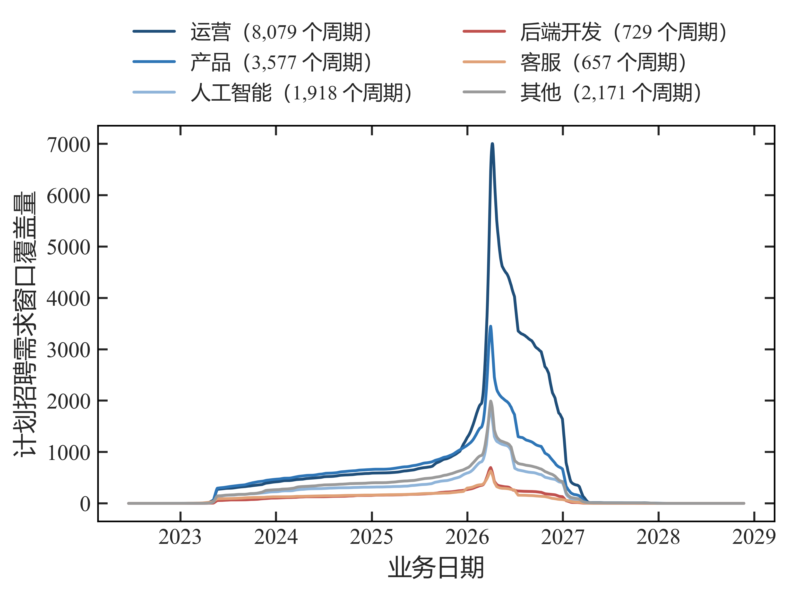
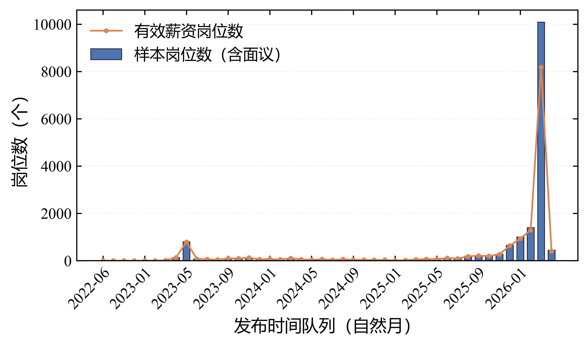
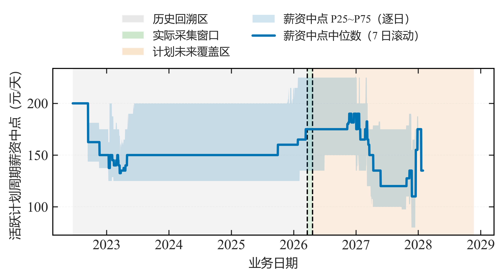
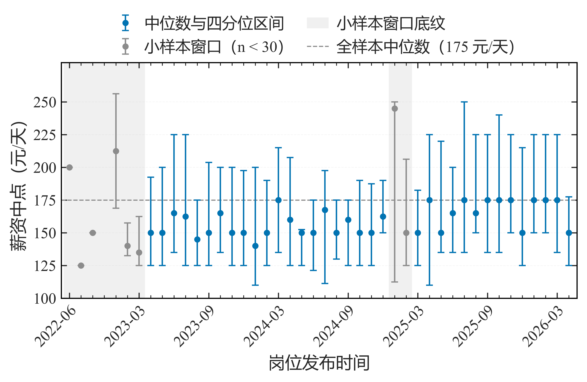

# 第 5 篇 · 时序数据处理与分析：观测折叠、版本与窗口指标

岗位数据在采集过程中会重复出现，且内容随时间变化。若将每条记录视为独立观测，频次与活跃度等指标会被系统性高估。本节说明时序数据的整理方法，包括时间标准化、重复观测折叠、版本识别与窗口指标计算。

岗位数据来自周期性采集，同一岗位会在不同时间被多次记录，内容可能保持不变，也可能发生变化。由此产生两个问题：一是同一时刻的重复记录并非独立观测——同一岗位在同一时刻被多个搜索来源分别抓取，属于同一次观测被记录多次；二是同一岗位的多次观测之间需要区分"内容未变"与"内容已变"。

因此，时序处理的流程包含四步：时间标准化、观测折叠、版本识别与窗口指标计算。本节按此顺序展开，并在时间处理部分说明时序特征构造的约束。实现基于 pandas 2.0+ 与 NumPy 1.26+，运行环境为 Python 3.10+；趋势分解（STL）使用 statsmodels 0.14+（可选）。

---


## 1 时间处理：业务时间与技术时间

时序数据中的时间字段包含两类，统计含义不同，需分别处理：

- **业务时间**：发布日期、截止日期等由业务产生的时间；
- **技术时间**：采集时间、数据更新时间等由采集管道产生的时间。

处理时先将时间统一为带时区的标准格式，避免跨时区比较时的偏差：

```python
import pandas as pd
df["observed_at"] = (pd.to_datetime(df["observed_at"], errors="coerce", utc=True)
                     .dt.tz_convert("Asia/Shanghai"))
df["observed_iso"] = df["observed_at"].dt.strftime("%Y-%m-%d %H:%M:%S%z")
```

两类时间的用途不同：业务时间用于构造与招聘周期相关的特征，技术时间用于记录数据来源与版本。以技术时间作为特征存在风险：技术时间记录的是"数据何时被采集"，若以其构造特征，相当于用事后信息描述当时的状态，会使模型在训练集上表现良好而在实际预测中失效。因此，特征仅使用在该时点已可获得的字段，数据划分也按时间切分（前段训练、后段测试），而不随机打乱。

---


## 2 观测整理：同一时点重复的折叠

同一岗位在同一时刻可能因多个搜索来源或翻页产生多行记录，这些记录属于同一次观测，需先行折叠，否则一次观测会被重复计数：

```python
def collapse_snapshots(df, id_col, time_col, business_fields):
    grp = df.groupby([id_col, time_col], sort=False)
    def merge(part):
        return part.head(1)      # 业务字段不一致时另标 conflict 留档
    return grp.apply(merge, include_groups=False).reset_index(drop=True)
```

折叠以"实体标识 + 观测时间"为键，同一键下保留一条记录；若同一键下的业务字段不一致，则另标冲突并留档，以便复核。项目中原始观测约 **17 万行**，若直接视为 17 万个独立时间点，频次与活跃度指标将被系统性高估。

---


## 3 版本识别：签名与连续压缩

折叠之后，需识别同一岗位的内容是否发生变化。做法是对每次观测生成签名，签名相同的连续观测视为同一版本。项目中使用了两种签名：

- **核心签名**：由业务关键字段生成，不含发布时间、截止时间、头图等易变字段；
- **完整页面签名**：由整个页面内容生成，用于留档与差异定位。

版本号按"相邻签名是否不同"递增，仅压缩连续相同的记录：

```python
s = pd.Series(["A", "A", "B", "A"])
print(s.ne(s.shift()).cumsum().tolist())     # 相邻不同则 +1
```

```text
[1, 1, 2, 3]
```

序列 `A A B A` 被切分为 **3 个版本**（1,1,2,3）。其中 `A → B → A` 保留为三段而非合并为一段，原因是"改回原状态"本身也是一次状态变更，合并会丢失该事件。完整实现如下：

```python
def build_versions(df, id_col, core_sig_cols, time_col):
    df = df.sort_values([id_col, time_col]).copy()
    df["core_sig"] = df[core_sig_cols].astype(str).agg("|".join, axis=1)
    changed = df.groupby(id_col, sort=False)["core_sig"].transform(lambda s: s.ne(s.shift()))
    df["core_version"] = changed.groupby(df[id_col]).cumsum()
    return df
```

---


## 4 窗口指标：覆盖量、流入与计划退出

### 4.1 三项指标的定义

由"发布日期—截止日期"构成的区间，可定义每个业务日的三项指标：

$$
N_t=\sum_e \mathbb{1}(p_e \le t \le d_e),\quad
A_t=\sum_e \mathbb{1}(p_e=t),\quad
C_t=\sum_e \mathbb{1}(d_e=t-1)
$$

其中 $p_e$ 与 $d_e$ 分别表示岗位 $e$ 的发布日与截止日。三项指标的含义为：

- $N_t$（覆盖量）：第 t 日在发布—截止区间内的岗位数；
- $A_t$（流入）：第 t 日新进入区间的岗位数；
- $C_t$（退出）：第 t 日结束区间的岗位数。

### 4.2 差分数组与复杂度优化

直接按日遍历全部区间的时间复杂度为 O(n·T)（n 为岗位数，T 为时间跨度）。改用差分数组可将区间标记转为端点增减，再以前缀和还原逐日数值，复杂度降至 O(n)：

```python
import numpy as np
def build_window_series(starts, ends, timeline):
    pos = {d: i for i, d in enumerate(timeline)}
    delta  = np.zeros(len(timeline) + 1, dtype="int64")
    inflow = np.zeros(len(timeline), dtype="int64")
    exit_  = np.zeros(len(timeline), dtype="int64")
    for p, d in zip(starts, ends):
        delta[pos[p]] += 1; delta[pos[d] + 1] -= 1     # 区间 +1 的差分
        inflow[pos[p]] += 1
        nxt = pos[d] + 1
        if nxt < len(timeline):
            exit_[nxt] += 1
    return np.cumsum(delta[:-1]), inflow, exit_         # N_t, A_t, C_t
```

其中 `delta` 记录区间起止处的增减量，`np.cumsum(delta[:-1])` 即覆盖量序列。若出现 $d_e < p_e$（截止早于发布）的记录，即区间无效，应输出至审计表供核查。

---


## 5 趋势与季节性

对单条序列，可用以下操作分离趋势与季节性：

```python
s = series.asfreq("D").interpolate()          # 补齐缺失日期
trend = s.rolling(7, min_periods=1).mean()    # 滚动均值看趋势
diff  = s.diff(7)                             # 7 天差看周季节

# from statsmodels.tsa.seasonal import STL
# res = STL(s, period=7, robust=True).fit()   # 稳健 STL 分解
```

`asfreq("D")` 将序列对齐到日频并补齐缺失日期；滚动均值用于观察趋势；差分用于观察周期性。构造滚动类特征时使用 `shift`，以确保特征仅使用该时点之前的数据，与前述时间约束一致。

---


## 6 项目实例

第 4 节的窗口指标在项目中的结果如下。

**图 1** 为按岗位大类分解的覆盖量 $N_t$（14 日滚动均值）：

```python
# 来源：scripts/experiments/03_E8_planned_demand_series.py
# 说明：常量 EPISODE / CATEGORY / TOP_CATEGORIES 及 build_series 见同文件
def build_series(starts, ends, timeline):
    """由窗口端点构造 N_t / A_t / C_t。"""
    position = {value: index for index, value in enumerate(timeline)}
    delta = np.zeros(len(timeline) + 1, dtype='int64')
    inflow = np.zeros(len(timeline), dtype='int64')
    exit_series = np.zeros(len(timeline), dtype='int64')
    for begin, finish in zip(starts, ends):
        delta[position[begin]] += 1
        delta[position[finish] + 1] -= 1
        inflow[position[begin]] += 1
        # 截止日当天仍计入窗口，因此计划退出计在 d_e + 1 当日
        next_day = position[finish] + 1
        if next_day < len(timeline):
            exit_series[next_day] += 1
    coverage = np.cumsum(delta[:-1])
    frame = pd.DataFrame({
        'date': timeline,
        'planned_demand_coverage_N': coverage,
        'new_window_A': inflow,
        'planned_exit_C': exit_series,
    })
    return frame

# 数据准备：严格统计范围的重构招聘周期 + 业务日期时间轴
episode = pd.read_parquet(EPISODE)
unique = episode.drop_duplicates(subset=['episode_id_strict']).copy()
unique['p_date'] = pd.to_datetime(unique['episode_start']).dt.normalize()
unique['d_date'] = pd.to_datetime(unique['final_observed_deadline']).dt.normalize()
missing = unique['p_date'].isna() | unique['d_date'].isna()
reversed_order = (~missing) & (unique['d_date'] < unique['p_date'])
expandable = (~missing) & (~reversed_order)
timeline = pd.date_range(unique.loc[expandable, 'p_date'].min(),
                         unique.loc[expandable, 'd_date'].max(), freq='D')

# 按岗位大类（周期数前 5 个大类 + 其他）分解
membership = pd.read_parquet(CATEGORY)
weight = membership.groupby([schema.ID_FIELD, '岗位大类'])['原始命中次数'].sum().reset_index()
primary = weight.sort_values(['实习岗位ID', '原始命中次数'],
                             ascending=[True, False]).drop_duplicates('实习岗位ID')
primary = primary.set_index(schema.ID_FIELD)['岗位大类']
unique['岗位大类'] = unique['intern_id'].map(primary)
counts = unique.loc[expandable, '岗位大类'].value_counts()
top = list(counts.index[:TOP_CATEGORIES])
unique['方向分档'] = np.where(unique['岗位大类'].isin(top), unique['岗位大类'], '其他')
rows = []
for label in top + ['其他']:
    block = unique.loc[expandable & unique['方向分档'].eq(label)]
    if not len(block):
        continue
    block_series = build_series(block['p_date'].tolist(), block['d_date'].tolist(), timeline)
    rows.append((label, len(block), block_series))

# ---- 图 4-6：按岗位大类分解的覆盖量（15.5 cm 版心宽、无图内标题、14 日滚动均值） ----
palette = ['#1F4E79', '#2E75B6', '#8FB4D9', '#C0504D', '#E0A177', '#9A9A9A']
with plt.rc_context({'font.size': 11.0, 'axes.labelsize': 12.0,
                     'xtick.labelsize': 11.0, 'ytick.labelsize': 11.0,
                     'legend.fontsize': 11.0}):
    fig, ax = plt.subplots(figsize=(15.5 / 2.54 * 11 / 12, 4.0))
    for (label, size, block_series), color in zip(rows, palette):
        ax.plot(block_series['date'],
                block_series['planned_demand_coverage_N'].rolling(14, min_periods=1).mean(),
                color=color, linewidth=1.4,
                label='%s（%s 个周期）' % (label, f'{size:,}'))
    ax.set_xlabel('业务日期')
    ax.set_ylabel('计划招聘需求窗口覆盖量')
    ax.legend(loc='lower center', bbox_to_anchor=(0.5, 1.01), ncol=2,
              frameon=False, fontsize=10.0)
    fig.subplots_adjust(left=0.155, right=0.985, bottom=0.165, top=0.845)
    figure_finalize.save_paper_figure(
        fig, FIGURES, 'fig_4_6_planned_demand_by_job_category',
        subfigures=[],
        meta={'数据来源': 'job_strict_episode_26_1.parquet × 岗位大类集合',
              '统计范围': '各方向 N_t 的 14 日滚动均值；分档 = 周期数前 5 个大类 + 其他',
              '方向分档': {label: int(size) for label, size, _ in rows}})
    plt.close(fig)
```



图中各类曲线整体走势相近，差异主要体现在量级上，反映不同岗位大类的样本规模差异。需要说明统计口径：$N_t$ 表示"样本中可重构的发布—截止区间覆盖量"，即样本内处于发布区间的岗位数，**不代表市场职位总量**，也不用于需求预测。

**图 2** 为发布时间队列（cohort）的样本岗位数量：

```python
# 来源：scripts/ch4_lifecycle/09_business_time_dimension.py
# 数据准备：monthly 为按岗位发布时间聚合到自然月的样本/薪资表
months = list(monthly.index)
positions = np.arange(len(months))
tick_pos = positions[::4]
tick_lab = [months[i] for i in tick_pos]
grid = {'linestyle': '--', 'linewidth': 0.45, 'alpha': 0.18}

# ---- 图 4-8：发布时间队列的样本岗位数量（15.5 cm 版心宽、无图内总图题） ----
with plt.rc_context({'font.size': 11.0, 'axes.labelsize': 12.0,
                     'xtick.labelsize': 11.0, 'ytick.labelsize': 11.0,
                     'legend.fontsize': 11.0}):
    fig, ax = plt.subplots(figsize=(15.5 / 2.54 * 11 / 12, 3.4))
    ax.bar(positions, monthly['样本岗位数'].to_numpy(), width=0.68,
           color='#4C72B0', edgecolor='black', linewidth=0.4,
           label='样本岗位数（含面议）')
    ax.plot(positions, monthly['有效薪资岗位数 n'].to_numpy(), color='#DD8452',
            linewidth=1.2, marker='o', markersize=2.4, label='有效薪资岗位数')
    ax.set_xticks(tick_pos)
    ax.set_xticklabels(tick_lab, rotation=45, ha='right', rotation_mode='anchor')
    ax.set_xlabel('发布时间队列（自然月）')
    ax.set_ylabel('岗位数（个）')
    ax.grid(True, axis='y', **grid)
    ax.set_axisbelow(True)
    ax.legend(loc='upper left', ncol=1, frameon=False)
    fig.subplots_adjust(left=0.105, right=0.985, bottom=0.24, top=0.965)
    figure_finalize.save_paper_figure(
        fig, FIGDIR, 'fig_4_8_publish_cohort_count', subfigures=[],
        meta={'数据来源': '唯一岗位表按岗位发布时间聚合到自然月',
              '统计范围': '柱＝样本岗位数（含薪资面议），线＝有效薪资岗位数；'
                      '逐月对照只描述本样本，不代表市场岗位存量'})
    plt.close(fig)
```



柱形为按发布月份统计的样本岗位数（含薪资面议），折线为其中的有效薪资岗位数。两序列之差即薪资面议岗位的规模。该图用于观察样本在不同时间段的进入数量，与观测折叠配合，可避免将同一岗位的多次观测计为多个岗位。

**图 3** 为活跃计划周期的薪资中位数与四分位距（7 日滚动中位数 + IQR 带）：

```python
# 来源：scripts/ch4_lifecycle/08_figures.py
def fig_s71() -> dict:
    """图 4-6（原图 4-8）：活跃计划周期薪资中位数与四分位区间（删除单图 (a) 标记）。"""
    import matplotlib.pyplot as plt

    # 复用 03_final_consolidation 的周期分界标注
    sys.path.insert(0, str(project_paths.SCRIPTS_DIR))
    import importlib.util
    spec = importlib.util.spec_from_file_location(
        '_consolidation', str(project_paths.SCRIPTS_DIR / 'ch4_lifecycle' / '03_final_consolidation.py'))
    module = importlib.util.module_from_spec(spec)
    sys.modules['_consolidation'] = module
    spec.loader.exec_module(module)

    # 数据准备：日级薪资聚合指标（37 号表 08_日级指标明细）
    daily = _read('ch4/37_stage26_1_lifecycle_statistics.xlsx', '08_日级指标明细')
    dates = pd.to_datetime(daily['date'])
    date_min, date_max = dates.min(), dates.max()

    fig, ax = plt.subplots(figsize=(_w(15.5), 3.6))
    handles = module._window_marks(ax, date_min, date_max)
    band = ax.fill_between(dates, daily['salary_p25'], daily['salary_p75'],
                           color=plot_style.MAIN_COLOR, alpha=0.18, linewidth=0,
                           label='薪资中点 P25~P75（逐日）')
    line = ax.plot(dates, daily['salary_median_7d'], color=plot_style.MAIN_COLOR,
                   linewidth=1.8, label='薪资中点中位数（7 日滚动）')[0]
    ax.set_xlabel('业务日期')
    ax.set_ylabel('活跃计划周期薪资中点（元/天）')
    ax.legend(handles + [band, line],
              [h.get_label() for h in handles + [band, line]],
              loc='lower center', bbox_to_anchor=(0.5, 1.005), ncol=2, frameon=False)
    plot_style.apply_sci_axis(ax, grid_axis='y')
    fig.subplots_adjust(left=0.135, right=0.985, bottom=0.30, top=0.80)
    diagnostics = _save(
        'fig_4_7_active_cycle_salary_quartile', fig, [],
        {'数据来源': 'job_strict_daily_panel_26_1.parquet 的日级薪资聚合', 'seed': SEED,
         '统计范围': '阴影带为逐日横截面 P25~P75，曲线为日横截面中位数的 7 日滚动中位数；'
                 '只保留这两项，删除单子图的 (a) 标记'})
    plt.close(fig)
    return diagnostics
```



按业务日期重构的薪资水平中，日薪资中位数的区间约为 **110~200**，全期中位数约为 **150**，IQR 中位数约为 **75**。曲线整体平稳，未见明显的趋势性变化。该图说明：以窗口指标可将横截面的薪资数据转换为按业务日期排列的序列，这是时序处理的常见产出。

**图 4** 为发布时间队列的薪资中位数及四分位区间：

```python
# 来源：scripts/figures/ch4/01_time_cohort_figures.py
STEM_SALARY = 'fig_4_9_salary_by_publish_time'
MIN_WINDOW_N = 30


def build_salary_figure(monthly: pd.DataFrame, full_median: float):
    """绘制薪资中位数及四分位区间图，返回 (fig, frame)。"""
    import matplotlib.pyplot as plt

    frame = _with_column(monthly, '月份')
    positions = np.arange(len(frame), dtype='float64')
    median = frame['薪资中位数 Median'].to_numpy('float64')
    p25 = frame['P25'].to_numpy('float64')
    p75 = frame['P75'].to_numpy('float64')
    sizes = frame['有效薪资岗位数 n'].to_numpy('float64')
    has_salary = ~np.isnan(median)
    sparse = sizes < MIN_WINDOW_N
    dense = has_salary & ~sparse
    thin = has_salary & sparse

    fig, ax = plt.subplots(figsize=(_w(15.5), 4.1))
    # n < 30 的窗口：浅色底纹，对应「仅展示、不作趋势解释」的窗口
    for position in positions[sparse]:
        ax.axvspan(position - 0.5, position + 0.5, facecolor=plot_style.MUTED_COLOR,
                   alpha=0.13, edgecolor='none', zorder=0.4)
    band_handle = plt.Rectangle((0, 0), 1, 1, facecolor=plot_style.MUTED_COLOR,
                                alpha=0.13, edgecolor='none')
    dense_bar = ax.errorbar(
        positions[dense], median[dense],
        yerr=[median[dense] - p25[dense], p75[dense] - median[dense]],
        fmt='o', color=plot_style.MAIN_COLOR, ecolor=plot_style.MAIN_COLOR,
        elinewidth=1.0, capsize=2.4, capthick=0.9, markersize=3.4, zorder=3)
    thin_bar = ax.errorbar(
        positions[thin], median[thin],
        yerr=[median[thin] - p25[thin], p75[thin] - median[thin]],
        fmt='o', color=plot_style.MUTED_COLOR, ecolor=plot_style.MUTED_COLOR,
        elinewidth=1.0, capsize=2.4, capthick=0.9, markersize=3.4, zorder=3)
    reference = ax.axhline(full_median, color=plot_style.MUTED_COLOR, linewidth=0.8,
                           linestyle='--', zorder=2)

    _apply_month_axis(ax, list(frame['月份'].astype(str)), step=6,
                      xlabel='岗位发布时间')
    ax.set_yticks(np.arange(100, 251, 25))
    ax.set_ylim(100, 280)
    ax.set_ylabel('薪资中点（元/天）', fontsize=FONTS['axis_label'])
    ax.legend(handles=[dense_bar, thin_bar, band_handle, reference],
              labels=['中位数与四分位区间', '小样本窗口（n < 30）',
                      '小样本窗口底纹', '全样本中位数（%.0f 元/天）' % full_median],
              loc='lower center', bbox_to_anchor=(0.5, 1.005), ncol=2, **LEGEND_KW)
    plot_style.apply_sci_axis(ax, grid_axis='y')
    fig.subplots_adjust(left=0.085, right=0.99, bottom=0.235, top=0.80)
    return fig, frame


def save_salary_figure(monthly: pd.DataFrame, full_median: float,
                       out_dir=FIGDIR, stem: str = STEM_SALARY) -> dict:
    """按论文版式出薪资图并做视觉门禁校验，返回诊断字典。"""
    import matplotlib.pyplot as plt

    plot_style.setup_sci_style()
    plot_style.FONT_SIZES.update(FONTS)
    fig, frame = build_salary_figure(monthly, full_median)
    diagnostics = figure_finalize.save_paper_figure(
        fig, out_dir, stem, subfigures=[],
        meta={'数据来源': '33 号表 03_发布时间月度薪资分布（岗位发布时间聚合到自然月）',
              '统计范围': '点为该发布月窗口内有效明确薪资岗位的薪资中点中位数，误差线为 P25~P75 真实'
                      '四分位区间（下误差 = 中位数 − P25，上误差 = P75 − 中位数）；'
                      'n < 30 的窗口加浅色底纹，仅展示、不作趋势解释；'
                      '参考线为全样本薪资中点中位数 %.0f 元/天' % full_median})
    plt.close(fig)
    return diagnostics


# 调用：读取冻结表（按月份升序）与全样本薪资中位数后出图
monthly = read_monthly_table()
save_salary_figure(monthly, read_full_median())
```



按发布月份分组的中位数波动区间与图 3 一致，参考线取自全样本薪资中位数，用于判断各时间段的岗位薪资相对全期水平的高低。

---


## 7 小结

时序数据的处理从时间字段的区分开始：业务时间用于构造与招聘周期相关的特征，技术时间仅用于记录来源与版本，特征只使用该时点已可得的信息，数据划分按时间切分。同一时点的重复记录以"实体标识 + 观测时间"为键折叠，冲突留档。版本识别基于签名，仅压缩连续相同的记录，`A→B→A` 保留为三段。窗口指标由发布—截止区间定义，包括覆盖量、流入与退出三项，采用差分数组将计算复杂度由 O(n·T) 降至 O(n)。趋势与季节性通过滚动、差分与 STL 分解观察，滚动特征以 `shift` 保证不引入未来信息。

---


## 8 延伸参考

- 相关文章：[8. Pandas 日期与时间序列数据处理](https://blog.csdn.net/MoRanzhi1203/article/details/152522744)；
- `statsmodels` STL 与时序分解文档；


上一篇：[04 文本处理与信息抽取](./第 4 篇 · 文本处理与信息抽取：语料构建与技能抽取.md) ｜ 下一篇：[06 数据可视化](./第 6 篇 · 数据可视化：按分析目的选择图形与导出规范.md)


