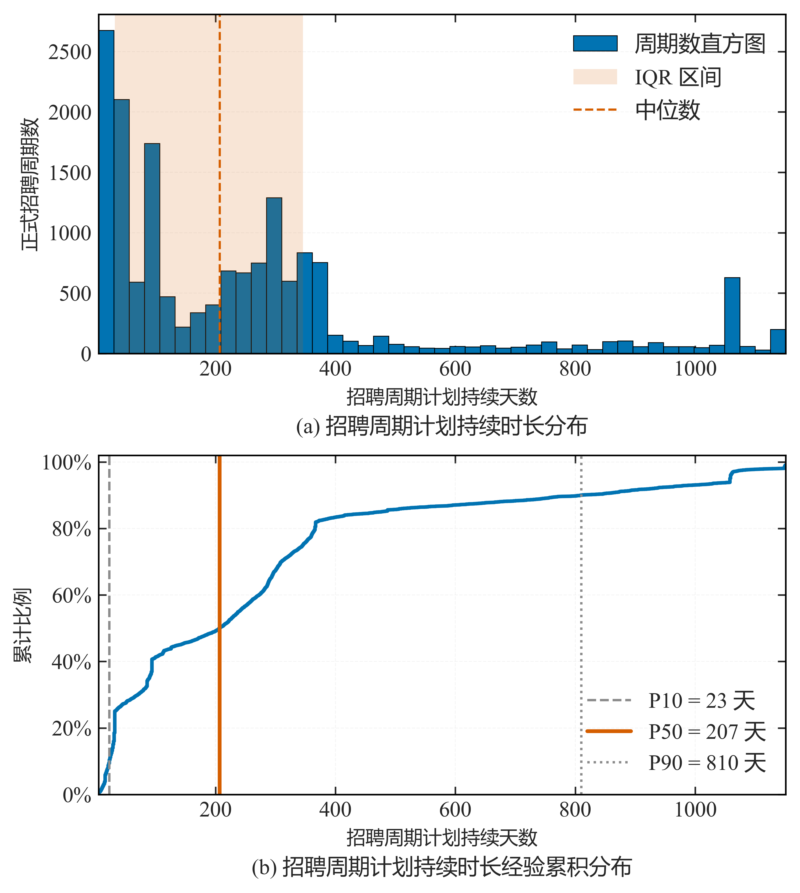
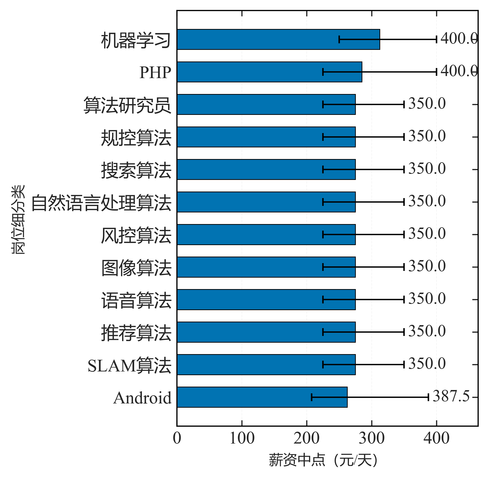
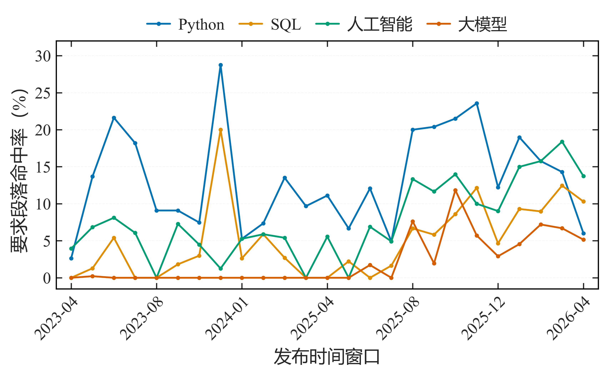
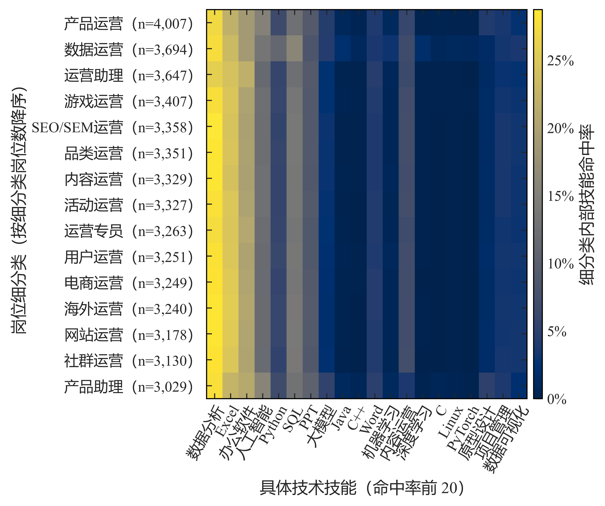
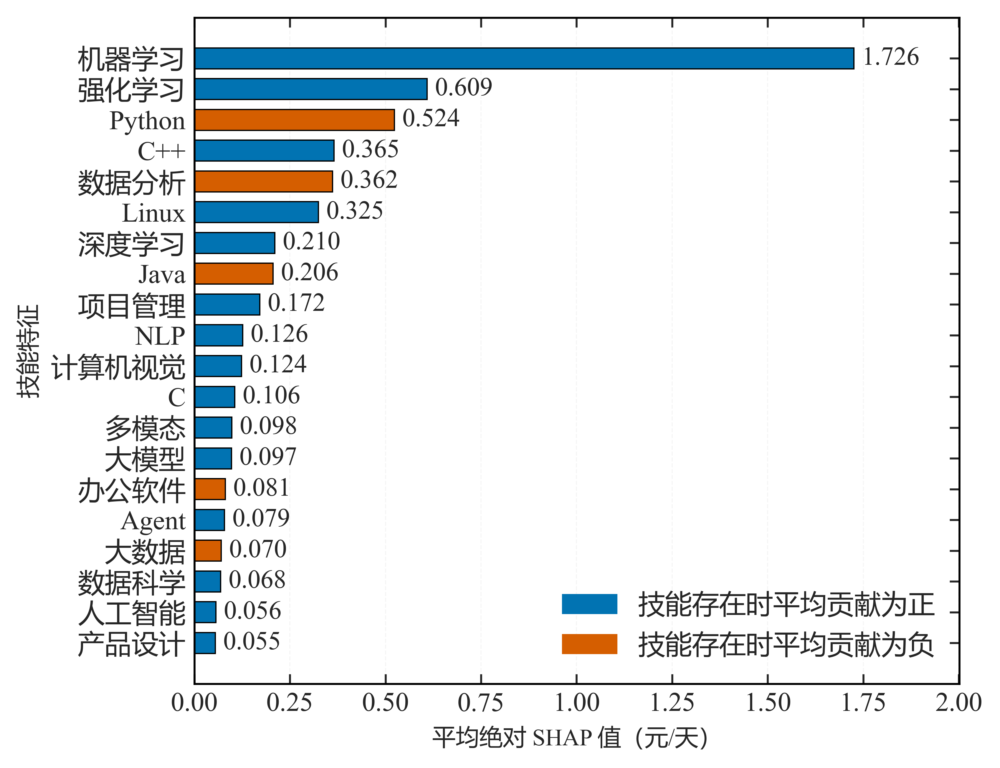
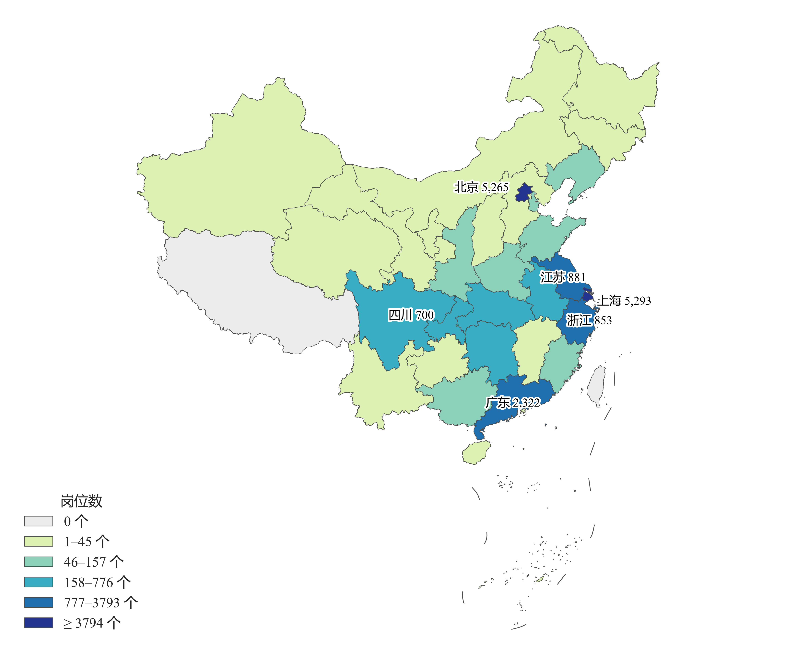

# 第 6 篇 · 数据可视化：按分析目的选择图形与导出规范

图形用于表达数据的分布、差异与关联，其作用是在有限的版面内传递统计结论。图形的选择取决于所要回答的问题，样式与导出方式则影响结论能否被准确读取。

同一份数据可以用多种图形呈现，但并非所有图形都能准确表达同一结论。例如用双轴折线同时表示量级差异较大的两条序列，其相对高低会随坐标轴取值范围而改变，读者的判断随之偏移。因此，图形选择应与分析目的对应：分布、分组差异、变量关系、构成比例、时间趋势等目的分别对应不同的图形类型。

本节先给出按分析目的选图的对照表，随后说明样式配置、分组对比的样本量标注与打印导出方式，最后以项目中的六张图表为例，说明图形选择与结论读取的对应关系。示例基于 Matplotlib 3.8+ 与 Seaborn 0.13+，运行环境为 Python 3.10+、pandas 2.0+、NumPy 1.26+（词云使用 wordcloud 1.9+，可选）。

---


## 1 按分析目的选择图形

选择图形的依据是"这张图要回答什么问题"：

| 要说明 | 选图 | 要点 |
| --- | --- | --- |
| 单变量分布 | 直方图 + 箱线图 | 标中位数 / 四分位；偏态用对数轴 |
| 分组对比 | 分组箱线 / 小提琴 / **哑铃图** | 标样本量 n |
| 两变量关系 | 散点 + 趋势线 | 点透明度防重叠 |
| 构成占比 | **环形图 / 堆叠条形** | 类别 ≤ 8 |
| 时间趋势 | 折线 + 置信带 | 双轴慎用 |
| 相关结构 | 热力图（Spearman） | 三角化 + 数值 |
| 空间分布 | 分级设色地图 / 气泡图 | 省级以上用分位分级 |
| 特征贡献 | 条形图（SHAP / 系数） | 标方向与频率 |

其中构成占比需注意类别数量：类别较多时饼图难以辨识各扇区的差异，类别数超过 8 时宜改用堆叠条形图或环形图；或保留前若干类别、将其余合并为"其它"。

---


## 2 样式配置

样式配置的目标是保证图形中的文字可读、颜色可辨。中文标签需指定可用字体，负号需单独设置以避免显示为方框：

```python
import matplotlib.pyplot as plt, seaborn as sns

def setup_style():
    plt.rcParams["font.sans-serif"] = ["SimHei", "Microsoft YaHei"]   # 中文字体
    plt.rcParams["axes.unicode_minus"] = False                        # 负号正常显示
    sns.set_theme(style="whitegrid",
                  rc={"figure.dpi": 130, "grid.linestyle": "--", "axes.linewidth": 1.2})
    plt.rcParams.update({"font.size": 12, "axes.labelsize": 12,
                         "xtick.labelsize": 11, "ytick.labelsize": 11})
```

上述字号适用于屏幕预览与常规版面；若图形需插入特定尺寸的文档，字号应按最终尺寸反推（见第 4 节）。配色方面，涉及多类别对比时建议使用色盲友好色板（`sns.color_palette("colorblind")`），避免仅以红绿区分类别。

---


## 3 分组对比与样本量标注

分组图需标注各组的样本量。样本量较少的组，其组内统计量的波动较大，若不标注样本量，读者无法区分组间差异来自真实差异还是样本量不足。以下函数在每组下方标注 `n`，并对样本量不足的组作背景高亮：

```python
def box_by_group(df, x, y, min_n=30):
    ax = sns.boxplot(data=df, x=x, y=y, color="#4C72B0", showfliers=False)
    counts = df.groupby(x)[y].count()
    for i, cat in enumerate(counts.index):
        if counts[cat] < min_n:
            ax.axvspan(i - 0.5, i + 0.5, color="#FFD9B3", alpha=0.3, zorder=0)   # 样本不足高亮
        ax.text(i, df[y].min(), f"n={counts[cat]}", ha="center", va="top", fontsize=8)
    return ax
```

`min_n` 为样本量阈值，低于该值即高亮提示。阈值可按分析目的调整，例如对需要作组间比较的图形，可取 30 左右。

---


## 4 打印与导出

图形在文档中通常会被缩放到版面宽度，因此字号应按最终版面尺寸反推，而不是按屏幕显示效果设定。以下函数按给定版心宽度与高度设置画布尺寸，并同时导出位图与矢量两种格式：

```python
def save_figure(fig, path, width_cm=15.5, height_cm=8.0, dpi=600):
    cm = 1 / 2.54
    fig.set_size_inches(width_cm * cm * (11 / 12), height_cm * cm)
    fig.tight_layout()
    fig.savefig(f"{path}.png", dpi=dpi, bbox_inches="tight")   # 位图：预览
    fig.savefig(f"{path}.pdf", bbox_inches="tight")            # 矢量：印刷 / 缩放
```

`width_cm` 与 `height_cm` 为图形在文档中的实际占用尺寸，按此尺寸绘制并在其中设置字号，可保证缩放后字号与预期一致。导出格式上，PNG 用于屏幕预览，PDF 为矢量格式，缩放时不失真，但部分平台不支持 PDF 预览，因此两者同时导出。此外，图内不写总标题，标题由文档中的图注承担，避免同一标题在图文两处重复。

---


## 5 项目图表分析

### 5.1 分布、分组与趋势

以下为项目中的六张图表，分别对应第 1 节中的不同图形类型。

**分布 · 招聘周期持续时长分布与累积分布**

```python
# 来源：scripts/ch4_lifecycle/06_final_polish.py
import matplotlib.pyplot as plt

unique = episodes.drop_duplicates(subset=['intern_id', 'episode_id_strict'])
duration = np.sort(unique.loc[unique['final_observed_planned_duration_days'] > 0,
                              'final_observed_planned_duration_days']
                   .to_numpy('float64'))
lower = float(np.quantile(duration, 0.005))
upper = float(np.quantile(duration, 0.99))
bins = np.linspace(lower, upper, 46)
fig, axes = plt.subplots(2, 1, figsize=(5.85, 6.4))
for ax in axes:
    for tick in ax.get_xticklabels() + ax.get_yticklabels():
        tick.set_fontsize(plot_style.FONT_SIZES['tick'])

ax = axes[0]
ax.hist(duration, bins=bins, color=plot_style.MAIN_COLOR, edgecolor='black',
        linewidth=0.4, label='周期数直方图')
median = float(np.median(duration))
q1, q3 = float(np.quantile(duration, 0.25)), float(np.quantile(duration, 0.75))
ax.axvspan(q1, q3, color=plot_style.ACCENT_COLOR, alpha=0.16, linewidth=0,
           label='IQR 区间')
ax.axvline(median, color=plot_style.ACCENT_COLOR, linestyle='--', linewidth=1.1,
           label='中位数')
ax.set_xlim(lower, upper)
ax.set_xlabel('招聘周期计划持续天数')
ax.set_ylabel('正式招聘周期数')
ax.legend(loc='upper right', frameon=False, fontsize=plot_style.FONT_SIZES['legend'])
plot_style.add_subfigure_caption(ax, 'a', '招聘周期计划持续时长分布',
                                 fontsize=plot_style.FONT_SIZES['legend'])
plot_style.apply_sci_axis(ax, grid_axis='y')

ax = axes[1]
cumulative = np.arange(1, duration.size + 1) / duration.size
ax.plot(duration, cumulative, color=plot_style.MAIN_COLOR, linewidth=1.8)
for quantile, color, style, width in (
        (0.10, plot_style.MUTED_COLOR, '--', 1.2),
        (0.50, plot_style.ACCENT_COLOR, '-', 1.9),
        (0.90, plot_style.MUTED_COLOR, ':', 1.2)):
    value = float(np.quantile(duration, quantile))
    label = f'P{int(quantile * 100)} = {value:.0f} 天'
    ax.axvline(value, color=color, linestyle=style, linewidth=width, label=label)
ax.set_xlim(lower, upper)
ax.set_ylim(0, 1.02)
ax.set_xlabel('招聘周期计划持续天数')
ax.set_ylabel('累计比例')
plot_style.format_percent_axis(ax, axis='y', decimals=0)
ax.legend(loc='lower right', frameon=False, fontsize=plot_style.FONT_SIZES['legend'])
plot_style.add_subfigure_caption(ax, 'b', '招聘周期计划持续时长经验累积分布',
                                 fontsize=plot_style.FONT_SIZES['legend'])
plot_style.apply_sci_axis(ax, grid_axis='both')
fig.subplots_adjust(left=0.155, right=0.975, bottom=0.135, top=0.985, hspace=0.30)

plt.show()
```



分析问题为"招聘周期的时长如何分布"。图形采用左侧直方图与右侧经验累积分布（ECDF）的组合：直方图用于观察形状，ECDF 用于读取分位点。由图可见分布呈强右偏，中位数明显小于均值，累积曲线在低时长区间上升较快。

**分组对比 · 主要岗位细分类薪资中点中位数及四分位区间**

```python
# 来源：scripts/ch4_lifecycle/08_figures.py
import matplotlib.pyplot as plt

plot_style.FONT_SIZES.update({'axis_label': 13.0, 'tick': 12.0, 'legend': 11.5,
                              'annotation': 11.5})

frame = _read('ch4/21_eda_statistical_analysis.xlsx', '03_岗位因素薪资')
frame = frame[frame['因素'].eq('岗位细分类')]
frame = frame.sort_values('中位数', ascending=False).head(12).sort_values('中位数')
lower = (frame['中位数'] - frame['P25']).to_numpy('float64')
upper = (frame['P75'] - frame['中位数']).to_numpy('float64')
errors = np.vstack([lower, upper])

fig, ax = plt.subplots(figsize=(_w(10.5), 4.9))
positions = np.arange(len(frame))
ax.barh(positions, frame['中位数'], height=0.62, color=plot_style.MAIN_COLOR,
        edgecolor='black', linewidth=0.5, xerr=errors,
        error_kw={'elinewidth': 0.9, 'capsize': 2.6})
ax.set_yticks(positions)
ax.set_yticklabels([str(item) for item in frame['取值']])
span = float(frame['P75'].max())
for position, value in zip(positions, frame['P75']):
    ax.text(float(value) + span * 0.015, position, f'{value:,.1f}', va='center',
            ha='left', fontsize=plot_style.FONT_SIZES['annotation'])
ax.set_xlim(0, span * 1.16)
ax.set_xlabel('薪资中点（元/天）')
ax.set_ylabel('岗位细分类')
plot_style.apply_sci_axis(ax, grid_axis='x')
fig.subplots_adjust(left=0.235, right=0.985, bottom=0.165, top=0.965)

plt.show()
```



分析问题为"不同岗位细分类的薪资水平是否存在差异"。图形为带误差线的点估计图。由于薪资分布右偏，误差线采用真实的四分位区间（下误差 = 中位数 − P25，上误差 = P75 − 中位数），两侧长度不等；若改用对称的 IQR/2，会令读者误认为误差对称分布。

**时间趋势 · 核心技能需求的发布时间队列变化**

```python
# 来源：scripts/figures/ch4/01_time_cohort_figures.py
import matplotlib.pyplot as plt

plot_style.setup_sci_style()
plot_style.FONT_SIZES.update(FONTS)

frame = _with_column(structure, 'period')
eligible = frame['主统计范围岗位数'].to_numpy('float64') >= MIN_WINDOW_N
windows = frame.loc[eligible].reset_index(drop=True)
positions = np.arange(len(windows), dtype='float64')

fig, ax = plt.subplots(figsize=(_w(15.5), 4.1))
lines = []
for color, skill in zip(SKILL_COLORS, SKILLS):
    values = windows['%s命中率' % skill].to_numpy('float64') * 100.0
    lines.append(ax.plot(positions, values, color=color, linewidth=1.2, marker='o',
                         markersize=2.8, markeredgewidth=0, label=skill, zorder=3)[0])

_apply_month_axis(ax, list(windows['period'].astype(str)), step=4,
                  xlabel='发布时间窗口', minor_ticks=False)
ax.set_yticks(np.arange(0, 31, 5))
ax.set_ylim(-1.5, 32)
ax.set_ylabel('要求段落命中率（%）', fontsize=FONTS['axis_label'])
plot_style.apply_sci_axis(ax, grid_axis='y')
fig.subplots_adjust(left=0.085, right=0.99, bottom=0.235, top=0.80)

plt.show()
```



分析问题为"核心技能的需求随时间如何变化"。图形为多序列折线图，仅绘制覆盖样本量达到阈值（≥ 30）的时间窗口，以避免样本量过小造成的曲线抖动影响趋势判断。

### 5.2 相关、贡献与空间

**相关结构 · 岗位细分类 × 技能命中率热力图**

```python
# 来源：scripts/figures/ch6/01_category_skill_heatmap.py
COLOR_LIMIT = 0.30
COLOR_TICKS = [0.0, 0.05, 0.10, 0.15, 0.20, 0.25, 0.30]
LABEL_ROTATION = 60
COLORBAR_LABEL = '细分类内部技能命中率'
COLORBAR_WIDTH = 0.016
COLORBAR_GAP = 0.010


def align_column_labels(ax) -> list:
    labels = [str(text.get_text()) for text in ax.get_xticklabels()]
    ax.set_xticklabels(labels, rotation=LABEL_ROTATION, ha='right', rotation_mode='anchor')
    return labels


def stretch_colorbar(fig) -> dict:
    heat = fig.axes[0]
    colorbar = next(axis for axis in fig.axes if axis.get_label() == '<colorbar>')
    box = heat.get_position()
    colorbar.set_box_aspect(None)
    colorbar.set_aspect('auto')
    colorbar.set_position([box.x1 + COLORBAR_GAP, box.y0, COLORBAR_WIDTH, box.height])
    return {'色条宽度': COLORBAR_WIDTH, '色条与坐标区间距': COLORBAR_GAP}


def percent_colorbar(fig) -> dict:
    from src import plot_style

    heat = fig.axes[0]
    colorbar = next(axis for axis in fig.axes if axis.get_label() == '<colorbar>')
    heat.images[0].set_clim(0.0, COLOR_LIMIT)
    colorbar.set_yticks(COLOR_TICKS)
    colorbar.set_yticklabels(['%.0f%%' % (value * 100) for value in COLOR_TICKS])
    colorbar.yaxis.set_major_formatter(PercentFormatter(xmax=1.0, decimals=0))
    colorbar.set_ylabel(COLORBAR_LABEL, fontsize=plot_style.FONT_SIZES['axis_label'])
    return {'色标上限': COLOR_LIMIT, '色条名': COLORBAR_LABEL}


fig, subfigures, meta = eda_figures.build_07_category_skill_heatmap({})
align_column_labels(fig.axes[0])
stretch_colorbar(fig)
percent_colorbar(fig)

plt.show()
```



分析问题为"岗位类别与技能需求之间存在何种对应关系"。热力图用于表达两个维度交叉处的强度，配色采用连续色阶而非红绿对比，便于区分相邻取值。

**特征贡献 · 技能特征 SHAP Top20**

```python
# 来源：scripts/_rework_history/26i_stage26_5_compute.py
plot_style.setup_sci_style()
plot_style.FONT_SIZES.update({'axis_label': 12.0, 'tick': 11.0, 'legend': 11.0,
                              'annotation': 10.5})

metrics = json.loads((METRICS_DIR / 'stage_26_4_model_sync.json').read_text(encoding='utf-8'))
skill = pd.DataFrame(metrics['技能SHAP']).head(20).iloc[::-1].reset_index(drop=True)
labels = [str(value) for value in skill['技能']]
values = skill['平均绝对SHAP值'].to_numpy('float64')
direction = np.where(skill['技能存在时平均SHAP'].to_numpy('float64') >= 0, 1.0, 0.0)
positions = np.arange(len(labels))
fig, ax = plt.subplots(figsize=(5.85, 4.6))
ax.barh(positions, values, height=0.68,
        color=[plot_style.MAIN_COLOR if flag > 0 else plot_style.ACCENT_COLOR
               for flag in direction],
        edgecolor='black', linewidth=0.5)
ax.set_yticks(positions)
ax.set_yticklabels(labels, fontsize=plot_style.FONT_SIZES['tick'])
span = float(values.max())
for position, value in zip(positions, values):
    ax.text(value + span * 0.012, position, f'{value:.3f}', va='center', ha='left',
            fontsize=plot_style.FONT_SIZES['annotation'])
ax.set_xlabel('平均绝对 SHAP 值（元/天）')
ax.set_ylabel('技能特征')
ax.set_xlim(0, span * 1.16)
ax.legend(handles=[plt.Rectangle((0, 0), 1, 1, color=plot_style.MAIN_COLOR,
                                 edgecolor='black', linewidth=0.5),
                   plt.Rectangle((0, 0), 1, 1, color=plot_style.ACCENT_COLOR,
                                 edgecolor='black', linewidth=0.5)],
          labels=['技能存在时平均贡献为正', '技能存在时平均贡献为负'],
          loc='lower right', frameon=False,
          fontsize=plot_style.FONT_SIZES['legend'])
plot_style.apply_sci_axis(ax, grid_axis='x')
fig.subplots_adjust(left=0.235, right=0.975, bottom=0.155, top=0.975)
plt.show()
```



分析问题为"哪些技能特征对预测的贡献较大、方向如何"。图形为横向条形图，条长为平均绝对 SHAP 值，条端标注数值；贡献方向由条形颜色区分（正/负），图例置于右下角。

**空间分布 · 互联网 IT 实习岗位样本的省域分布**

```python
# 来源：scripts/_rework_history/26i_stage26_5_compute.py
GEO_PROVINCE_URL = 'https://geo.datav.aliyun.com/areas_v3/bound/100000_full.json'
GEO_ALL_URL      = 'https://geo.datav.aliyun.com/areas_v3/bound/all.json'
geojson = json.loads(_download(GEO_PROVINCE_URL, MAP_CACHE / '100000_full.json').decode('utf-8'))
catalog = json.loads(_download(GEO_ALL_URL, MAP_CACHE / 'all.json').decode('utf-8'))
mapping, provinces = build_city_to_province(catalog)

entity = pd.read_parquet(project_paths.PROCESSED_UNIQUE_PARQUET,
                         columns=[schema.ID_FIELD, '工作城市'])
city_counts = entity['工作城市'].astype(str).value_counts()
province_counts = collections.Counter()
for city, number in city_counts.items():
    candidates = mapping.get(core_name(city), set())
    if len(candidates) == 1:
        province_counts[next(iter(candidates))] += int(number)

named = [feature['properties']['name'] for feature in geojson['features']
         if feature['properties'].get('name')]
table = pd.DataFrame([{'省级行政区': name, '岗位数': int(province_counts.get(name, 0))}
                      for name in named]).sort_values('岗位数', ascending=False)

plot_style.setup_sci_style()
values = np.array([province_counts.get(name, 0) for name in named], dtype='float64')
positive = np.sort(values[values > 0])
starts = [1]
for quantile in (0.45, 0.70, 0.85, 0.95):
    value = int(math.ceil(float(np.quantile(positive, quantile))))
    if value > starts[-1]:
        starts.append(value)
classes = [(0, 0)]
for index, start in enumerate(starts):
    classes.append((start, starts[index + 1] - 1 if index + 1 < len(starts) else None))
base = plt.get_cmap('YlGnBu')
colors = ['#ececec'] + [base(0.18 + 0.70 * index / max(len(classes) - 2, 1))
                        for index in range(len(classes) - 1)]

def class_of(number: int) -> int:
    if number <= 0:
        return 0
    return int(np.clip(bisect.bisect_right(starts, number), 1, len(classes) - 1))

fig, ax = plt.subplots(figsize=(6.6, 5.4))
fig.subplots_adjust(left=0.004, right=0.996, bottom=0.004, top=0.996)
ax.set_axis_off()
polygons, shades = [], []
for feature in geojson['features']:
    name = feature['properties'].get('name')
    color_index = class_of(int(province_counts.get(name, 0))) if name else 0
    for ring in _polygon_rings(feature['geometry']):
        array = np.asarray(ring, dtype='float64')
        if array.shape[0] < 4:
            continue
        x, y = albers_project(array[:, 0], array[:, 1])
        polygons.append(np.column_stack([x, y]))
        shades.append(color_index)
collection = PolyCollection(polygons, facecolors=[colors[index] for index in shades],
                            edgecolors='#4d4d4d', linewidths=0.32)
ax.add_collection(collection)
all_points = np.vstack(polygons)
xmin, ymin = all_points.min(axis=0) - 0.02
xmax, ymax = all_points.max(axis=0) + 0.02
box = ax.get_position()
ratio = (box.width * fig.get_figwidth()) / (box.height * fig.get_figheight())
if (xmax - xmin) / (ymax - ymin) < ratio:
    extra = ((ymax - ymin) * ratio - (xmax - xmin)) / 2.0
    xmin, xmax = xmin - extra, xmax + extra
else:
    extra = ((xmax - xmin) / ratio - (ymax - ymin)) / 2.0
    ymin, ymax = ymin - extra, ymax + extra
ax.set_xlim(xmin, xmax)
ax.set_ylim(ymin, ymax)
ax.set_aspect('equal')

offsets = {'上海市': (0.048, -0.010), '北京市': (-0.055, 0.014),
           '天津市': (0.048, 0.010), '江苏省': (0.006, 0.018),
           '浙江省': (0.018, -0.020), '安徽省': (0.0, 0.0),
           '湖北省': (0.0, 0.0)}
centers = {feature['properties'].get('name'): feature['properties'].get('center')
           for feature in geojson['features']}
span_x, span_y = xmax - xmin, ymax - ymin
for _, row in table.head(6).iterrows():
    center = centers.get(row['省级行政区'])
    if not center:
        continue
    x, y = albers_project(center[0], center[1])
    fx, fy = offsets.get(row['省级行政区'], (0.0, 0.0))
    ax.text(float(x) + fx * span_x, float(y) + fy * span_y,
            '%s %s' % (core_name(row['省级行政区']), f"{int(row['岗位数']):,}"),
            ha='center', va='center', fontsize=plot_style.FONT_SIZES['annotation'] - 0.6,
            color='black', zorder=6,
            path_effects=[patheffects.withStroke(linewidth=2.0, foreground='white')])

handles, labels = [], []
for (low, high), color in zip(classes, colors):
    handles.append(Patch(facecolor=color, edgecolor='#4d4d4d', linewidth=0.4))
    labels.append('≥ %d 个' % low if high is None else
                  ('%d 个' % low if low == high else '%d–%d 个' % (low, high)))
ax.legend(handles, labels, title='岗位数', loc='lower left', frameon=False,
          fontsize=plot_style.FONT_SIZES['legend'], title_fontsize=plot_style.FONT_SIZES['legend'])

plt.show()
```



分析问题为"岗位样本在地理上的分布情况"。图形为分级设色地图，分级依据分位点，以避免个别省份的极值压缩其余省份的色阶差异；图内仅标注岗位数排名前 6 的省名与数量，避免标签重叠。

---


## 6 小结

图形选择应与分析目的对应：分布类问题使用直方图与累积分布，分组差异使用带样本量标注的箱线图或点估计图，变量关系使用散点图，相关结构使用热力图，地理分布使用分级设色地图，特征贡献使用条形图。样式配置需处理中文字体与负号显示，多类别对比宜使用色盲友好色板。分组图应标注各组样本量，并对样本量不足的组作提示。图形字号按文档中的最终尺寸反推，导出时同时提供位图与矢量两种格式，图内不重复书写标题。上述方式在项目中用于生成各类图表，使图形与结论之间保持明确的对应关系。

---


## 7 延伸参考

- 相关文章：[14. Pandas 与 Matplotlib 可视化](https://blog.csdn.net/MoRanzhi1203/article/details/152663619)、[一维概率分布可视化实践](https://blog.csdn.net/MoRanzhi1203/article/details/159088712)；
- Matplotlib 与 Seaborn 官方 gallery；色盲友好配色 `sns.color_palette("colorblind")`；


上一篇：[05 时序数据处理与分析](./第 5 篇 · 时序数据处理与分析：观测折叠、版本与窗口指标.md) ｜ 下一篇：[07 统计分析与推断](./第 7 篇 · 统计分析与推断：非参数检验、效应量与 FDR.md)


