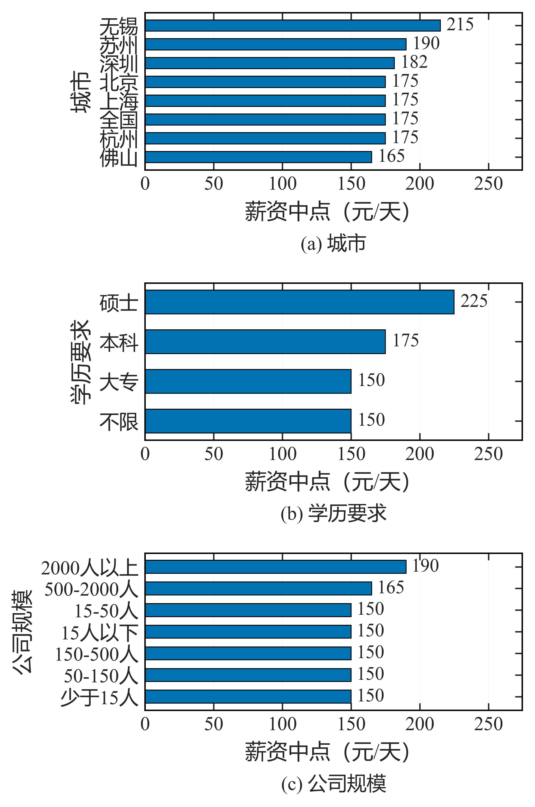
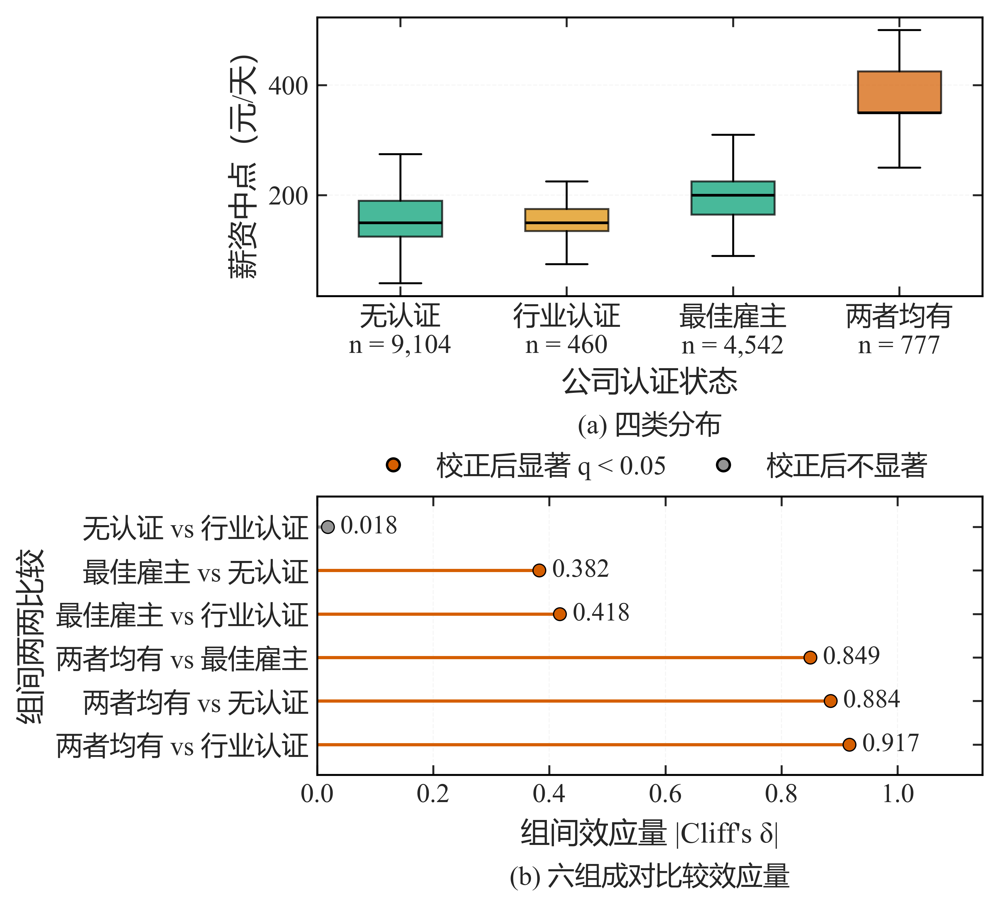
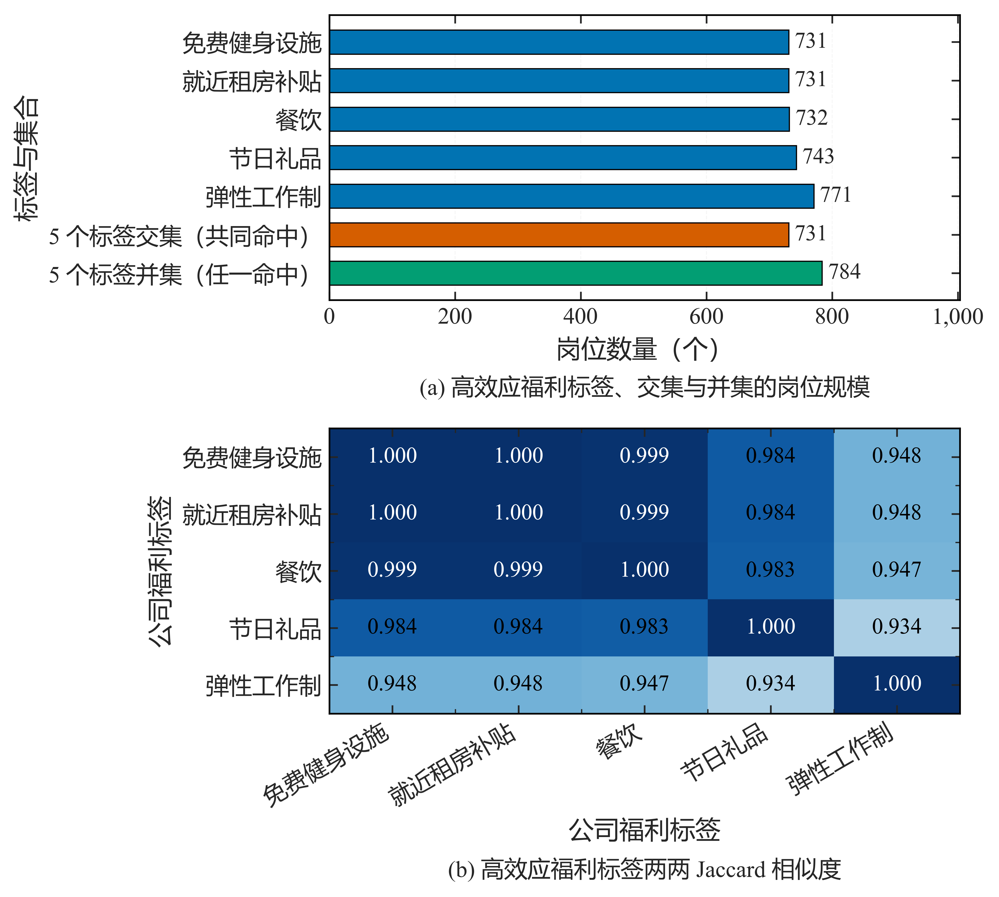
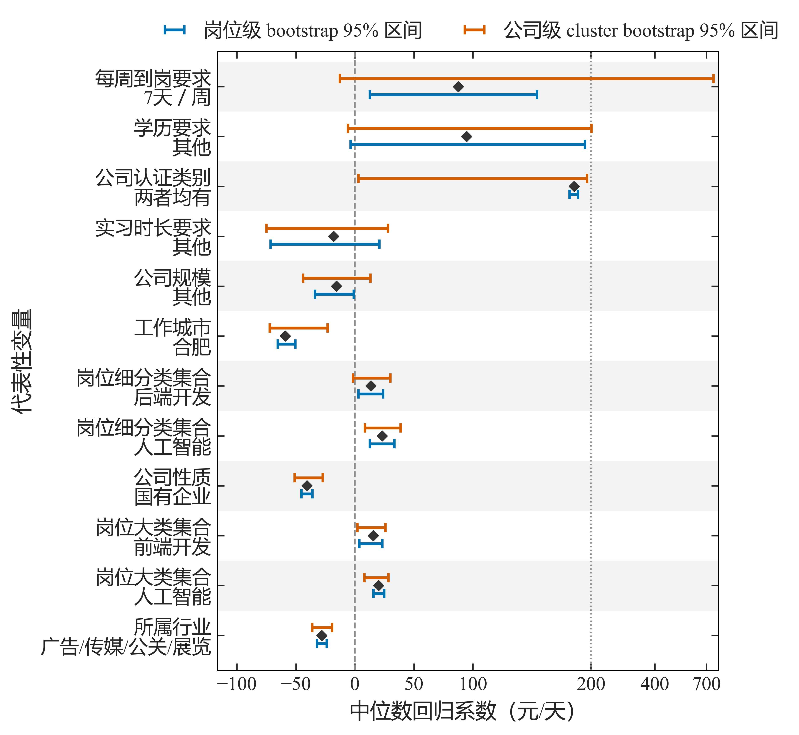

# 第 7 篇 · 统计分析与推断：非参数检验、效应量与 FDR

统计推断用于在样本数据上判断组间差异与变量关联，并给出不确定性的度量。薪资类数据通常右偏、分组样本量不均衡，方法选择需先检查前提；在此基础上，结论应同时报告效应量与区间，并对多重比较作相应控制。

在"两组薪资是否存在差异"这类问题中，直接进行 t 检验并以 p < 0.05 下结论是常见做法。但薪资类数据具有右偏、长尾与分组样本量不均衡等特点，均值类参数检验所依赖的分布前提通常难以满足；同时，p 值只说明差异能否被辨识，并不反映差异的幅度，样本量较大时微小差异亦可达到显著。

据此，统计推断的完整流程应包含四个环节：方法选择（含前提检查）、显著性与效应量报告、多重比较控制，以及区间估计。本节按此顺序展开，覆盖描述统计与分布拟合、参数与非参数检验、效应量（Cliff's delta、epsilon²）、错误发现率控制（BH-FDR）、Spearman 相关与 OLS 回归，以及聚类 bootstrap 区间；统计功能来自 SciPy 的 `stats` 模块，回归部分使用 statsmodels。运行环境为 Python 3.10+、NumPy 1.26+、SciPy 1.11+、pandas 2.0+，其中 statsmodels 0.14+ 为可选依赖。

---


## 1 方法选择：参数与非参数检验的适用条件

参数检验（t 检验、方差分析）以正态性、方差齐性等为前提，在前提成立时检验效能较高；当数据右偏、存在长尾，或各组样本量差异较大时，这些前提往往不成立，此时非参数检验更为稳健。两类方法并非互相替代，而应按数据条件选择：

| 场景 | 方法 | 效应量 |
| --- | --- | --- |
| 两组 | Mann–Whitney U | Cliff's delta |
| 多组 | Kruskal–Wallis | epsilon² |
| 相关 | Spearman ρ | ρ |
| 分布一致性 | K-S 检验 | — |

非参数检验不假设具体分布形状，对离群值不敏感，因而更契合薪资类数据的特征。

当方法的适用条件无法满足时，处理方式是修订方法并记录，而非沿用原检验。项目中的一个实例是：多个岗位类别存在重叠（同一岗位可命中多类）时，对全体类别直接进行 Kruskal–Wallis 并不成立，因此将该项推断标记为 `DEPRECATED_INFERENCE`，改用二元 present / absent 比较：

```python
DEPRECATED_INFERENCE_FLAG = "DEPRECATED_INFERENCE（已废止推断）"
```

---


## 2 显著性与效应量

### 2.1 效应量的意义：Cliff's delta

仅报告 p 值不足以支撑结论。p 值反映差异能否被辨识，效应量反映差异的幅度，二者应同时报告并附样本量。Cliff's delta 的取值范围为 [-1, 1]，绝对值越大表示两组分离越明显：

```python
import numpy as np
from scipy import stats

def cliffs_delta(a, b) -> float:
    a, b = np.asarray(a), np.asarray(b)
    gt = sum((x > b).sum() for x in a)      # a 中大于 b 各元素的次数
    lt = sum((x < b).sum() for x in a)
    return (gt - lt) / (len(a) * len(b))

print(cliffs_delta([1, 2, 3], [4, 5, 6]))
```

```text
-1.0
```

a 中的元素全部小于 b，delta 取 -1.0，表示两组完全分离。

### 2.2 多组比较：Kruskal–Wallis 与 epsilon²

多组比较使用 Kruskal–Wallis 检验，并以 epsilon² 作为效应量；样本量过少的组先予过滤：

```python
def compare_groups(df, group_col, value_col, min_n=30):
    groups = [g[value_col].dropna().to_numpy() for _, g in df.groupby(group_col)]
    groups = [g for g in groups if len(g) >= min_n]      # 先过滤样本过少的组
    if len(groups) < 2:
        return None
    H, p = stats.kruskal(*groups)
    n = sum(len(g) for g in groups)
    return {"p": p, "epsilon_squared": H * (n + 1) / (n ** 2 - 1), "k": len(groups), "n": n}
```

样本量较小时检验的稳定性下降，此时应在结果中标注样本量，并避免据此给出确定性结论。

---


## 3 多重比较与错误发现率控制

单次执行的检验数量上升时（例如逐个福利标签与薪资比较），假阳性比例随之增加，因此需对 p 值作多重比较校正。常用做法是 Benjamini–Hochberg 方法，通过控制错误发现率（FDR）限制假阳性在显著结果中的占比：

```python
def bh_fdr(pvals, alpha=0.05):
    p = np.asarray(pvals, float); m = len(p); order = np.argsort(p)
    passed = np.zeros(m, bool)
    below = p[order] <= alpha * (np.arange(1, m + 1) / m)
    if below.any():
        passed[order[:np.max(np.where(below)[0]) + 1]] = True
    return passed.tolist()
```

未经校正即声称"发现 20 个显著标签"，其中相当比例可能来自随机波动。

---


## 4 相关分析与回归

变量之间的单调关系使用 Spearman 秩相关，回归使用普通最小二乘（OLS）：

```python
rho, p = stats.spearmanr(df["skill_count"], df["salary_mid"])   # 相关用 Spearman，抗单调非线性

import statsmodels.api as sm
model = sm.OLS(df["salary_mid"], sm.add_constant(df[["skill_count", "intern_months"]])).fit()
print(model.summary())     # 系数 + 标准误 / CI + p 值
```

回归结果应报告系数、置信区间与 p 值。需说明的是，回归系数反映变量间的统计关联；薪资与技能数量等变量可能同时受岗位类别、地域等因素影响，因此结论限于关联描述，不作因果解释。

---


## 5 区间估计与聚类 bootstrap

在点估计之外，区间估计用于刻画不确定性。bootstrap 通过对样本重采样获得统计量的经验分布，并据此构造置信区间。其关键在于重采样单位的选取：同一公司的岗位在业务上并不独立，若以岗位为单位重采样，会将同源记录视为独立样本，从而低估区间宽度。项目据此对**岗位级**与**公司级**（cluster）两种 bootstrap 的结果进行了比较，详见下节。

---


## 6 项目结果

**图 1** 为城市、学历与公司规模三类单值因素的薪资中点中位数。三类因素均为分类变量，适合采用分组对比的方式呈现取值级差异：

```python
# 来源：scripts/figures/ch5/01_city_education_company_salary.py
import re

import matplotlib.pyplot as plt
from src.script_support import apply_style as _apply_style
from src.script_support import load_script as _load

PANELS = ['城市', '学历要求', '公司规模']
MODE_ARGS = ('stack', 10.5, 2.15,
             {'left': 0.20, 'right': 0.975, 'bottom': 0.115, 'top': 0.955, 'hspace': 0.72})


def clean_labels_and_unify_axis(fig) -> float:
    limits = [float(max(patch.get_width() for patch in ax.patches)) for ax in fig.axes]
    span = max(limits) * 1.22
    for ax, label in zip(fig.axes, PANELS):
        ax.set_xlim(0.0, span)
        ax.set_ylabel(label)
        for text in ax.texts:
            matched = re.match(r'^\(([a-z])\)\s', str(text.get_text()).strip())
            if matched:
                text.set_text('(%s) %s' % (matched.group(1), label))
    return span


g = _load('_figure_rebuild', 'scripts/ch4_lifecycle/07_figure_rebuild.py')
eda_figures = _load('_eda_figures', 'scripts/figures/base/01_eda_modeling_figures.py')
_apply_style(g)
g._apply_mode(*MODE_ARGS)

fig, _, meta = eda_figures.build_04_structured_factor_salary({})
clean_labels_and_unify_axis(fig)
plt.show()
```



**图 2** 给出公司认证状态对薪资的影响，同时呈现各类别的薪资分布与组间效应量 `|Cliff's δ|`。仅比较 p 值无法反映差异幅度，δ 用于补充该信息：

```python
# 来源：scripts/figures/ch5/02_certification_salary.py
import re

import matplotlib.pyplot as plt
from src.script_support import apply_style as _apply_style
from src.script_support import load_script as _load

MODE_ARGS = ('stack', 15.5, 2.85,
             {'left': 0.30, 'right': 0.975, 'bottom': 0.145, 'top': 0.90, 'hspace': 0.72})


def clean_labels(fig) -> None:
    ax_a, ax_b = fig.axes[0], fig.axes[1]

    labels = []
    for label in ax_a.get_xticklabels():
        content = str(label.get_text())
        replaced = re.sub(r'\(n = ([\d,]+)\)', r'n = \1', content)
        labels.append(replaced)
    ax_a.set_xticklabels(labels)

    ax_b.set_xlabel("组间效应量 |Cliff's δ|")

    delta_max = max(float(line.get_xdata()[0]) for line in ax_b.lines)
    ax_b.set_xlim(0.0, delta_max * 1.25)

    legend = ax_b.get_legend()
    if legend is not None:
        for text in legend.get_texts():
            content = str(text.get_text())
            replaced = content.replace('（q < 0.05）', ' q < 0.05')
            if replaced != content:
                text.set_text(replaced)


g = _load('_figure_rebuild', 'scripts/ch4_lifecycle/07_figure_rebuild.py')
supplementary_figures = _load('_supplementary_figures', 'scripts/figures/base/02_supplementary_figures.py')
_apply_style(g)
g.setup_supplementary_figures(supplementary_figures)
supplementary_figures.note = lambda *args, **kwargs: None
g._apply_mode(*MODE_ARGS)

fig, subfigures = supplementary_figures.fig_s04(0)
g.round_labels(fig, 3)
clean_labels(fig)
plt.show()
```



**图 3** 为经 BH-FDR 校正后筛出的高效应福利标签及其共现结构。图中显示高效应标签集中在少数高频标签上，同时存在明显的共现关系：

```python
# 来源：scripts/figures/ch5/03_benefit_overlap.py
from matplotlib import pyplot as plt

from src import plot_style
from src.script_support import apply_style as _apply_style
from src.script_support import load_script as _load

CAPTIONS = [('a', '高效应福利标签、交集与并集的岗位规模'),
            ('b', '高效应福利标签两两 Jaccard 相似度')]
MODE_ARGS = ('stack', 15.5, 2.9,
             {'left': 0.235, 'right': 0.975, 'bottom': 0.135, 'top': 0.925, 'hspace': 0.45})


g = _load('_figure_rebuild', 'scripts/ch4_lifecycle/07_figure_rebuild.py')
supplementary_figures = _load('_supplementary_figures', 'scripts/figures/base/02_supplementary_figures.py')
_apply_style(g)
g.setup_supplementary_figures(supplementary_figures)
supplementary_figures.note = lambda *args, **kwargs: None
g._apply_mode(*MODE_ARGS)

fig, axes = plt.subplots(2, 1, figsize=(5.85, 5.8))
supplementary_figures.tag_overlap_bars(axes[0])
supplementary_figures.tag_jaccard_heatmap(axes[1])
for (letter, caption), ax in zip(CAPTIONS, axes):
    plot_style.add_subfigure_caption(ax, letter, caption)
fig.subplots_adjust()

plt.show()
```



共现结构提示：部分显著标签由同一批岗位反复命中，其显著性并非完全独立，解读时需结合共现情况判断。

**图 4** 对比了中位数回归系数的岗位级与公司级 cluster bootstrap 95% 区间：

```python
# 来源：scripts/figures/ch5/04_median_regression_bootstrap.py
import numpy as np
import pandas as pd
from matplotlib import pyplot as plt
from matplotlib.ticker import FixedLocator, FuncFormatter

from src import plot_style, project_paths

CSV = project_paths.RESULTS_E2_E7 / 'quantile_regression_cluster_bootstrap.csv'
PRINT_WIDTH_CM = 16.0
PRINT_HEIGHT_CM = 16.5
SYMLOG_LINTHRESH = 200.0
TICKS = [-100, -50, 0, 50, 100, 200, 400, 700]
CM = 1.0 / 2.54
FONT_SCALE = 11.0 / 12.0
FONTS = {'axis_label': 12.0, 'tick': 11.0, 'legend': 11.0, 'annotation': 10.5}


def _w(width_cm: float) -> float:
    return width_cm * CM * FONT_SCALE


def _label(name: str) -> str:
    factor, _, value = str(name).partition('=')
    return '%s\n%s' % (factor, value) if value else str(name)


def load_representative() -> pd.DataFrame:
    frame = pd.read_csv(CSV)
    frame = frame[frame['是否代表性变量'].astype(str).str.lower().isin(['true', '1'])]
    frame = frame.reindex(frame['公司级区间宽度'].sort_values(ascending=False).index)
    return frame.reset_index(drop=True)


def build_figure(frame: pd.DataFrame):
    height = PRINT_HEIGHT_CM / PRINT_WIDTH_CM * _w(PRINT_WIDTH_CM)
    fig, ax = plt.subplots(figsize=(_w(PRINT_WIDTH_CM), height))

    y = np.arange(len(frame), dtype='float64')
    job_lower = frame['岗位级 CI95 下界'].to_numpy('float64')
    job_upper = frame['岗位级 CI95 上界'].to_numpy('float64')
    cluster_lower = frame['公司级 CI95 下界'].to_numpy('float64')
    cluster_upper = frame['公司级 CI95 上界'].to_numpy('float64')
    coefficient = frame['系数'].to_numpy('float64')

    for row in y[::2]:
        ax.axhspan(row - 0.5, row + 0.5, facecolor='#f2f2f2', edgecolor='none', zorder=0.4)

    ax.errorbar(coefficient, y + 0.16,
                xerr=np.vstack([coefficient - job_lower, job_upper - coefficient]),
                fmt='none', ecolor=plot_style.MAIN_COLOR, elinewidth=1.6, capsize=2.6,
                capthick=1.4, zorder=3, label='岗位级 bootstrap 95% 区间')
    ax.errorbar(coefficient, y - 0.16,
                xerr=np.vstack([coefficient - cluster_lower, cluster_upper - coefficient]),
                fmt='none', ecolor=plot_style.ACCENT_COLOR, elinewidth=1.6, capsize=2.6,
                capthick=1.4, zorder=3, label='公司级 cluster bootstrap 95% 区间')
    ax.scatter(coefficient, y, marker='D', s=15, color='#333333', zorder=4)
    ax.axvline(0, color=plot_style.MUTED_COLOR, linestyle='--', linewidth=0.9, zorder=2)
    ax.axvline(SYMLOG_LINTHRESH, color=plot_style.MUTED_COLOR, linestyle=':',
               linewidth=0.8, zorder=2)

    ax.set_xscale('symlog', linthresh=SYMLOG_LINTHRESH)
    ax.xaxis.set_major_locator(FixedLocator(TICKS))
    ax.xaxis.set_major_formatter(
        FuncFormatter(lambda value, _pos: ('%g' % value).replace('-', '\u2212')))
    ax.xaxis.set_minor_locator(FixedLocator([]))
    ax.set_yticks(y)
    ax.set_yticklabels([_label(name) for name in frame['变量']], linespacing=1.05)
    ax.set_ylim(-0.7, len(frame) - 0.3)
    ax.invert_yaxis()
    ax.set_xlabel('中位数回归系数（元/天）', fontsize=FONTS['axis_label'])
    ax.set_ylabel('代表性变量', fontsize=FONTS['axis_label'])
    ax.legend(loc='lower center', bbox_to_anchor=(0.5, 1.005), ncol=2, frameon=False,
              fontsize=FONTS['legend'], columnspacing=1.8, handletextpad=0.6,
              handlelength=1.8, borderaxespad=0.0)
    plot_style.apply_sci_axis(ax, grid=False)
    fig.subplots_adjust(left=0.30, right=0.985, bottom=0.105, top=0.925)
    return fig, ax


plot_style.setup_sci_style()
plot_style.FONT_SIZES.update(FONTS)
plt.rcParams.update({'axes.labelsize': FONTS['axis_label'],
                     'xtick.labelsize': FONTS['tick'],
                     'ytick.labelsize': FONTS['tick']})

frame = load_representative()
fig, _ = build_figure(frame)
plt.show()
```



同一批系数下，公司级区间普遍更宽，说明按岗位重采样会低估不确定性，这与"同公司岗位不独立"的数据结构一致。

---


## 7 小结

统计推断的可信度取决于方法与前提的匹配：对右偏、样本不均衡的数据，非参数检验更为稳健；结论应同时报告 p 值、效应量与样本量，并在批量检验时作多重比较校正。区间估计需注意重采样单位，聚类 bootstrap 更贴合同源记录不独立的数据结构。回归与相关结果表述限于统计关联，不进行因果推断；方法前提无法满足时，应以修订并记录的方式处理，而非沿用原检验。

---


## 8 延伸参考

- 相关文章：[掌握 SciPy 统计模块：概率分布、参数估计与假设检验](https://blog.csdn.net/MoRanzhi1203/article/details/153159058)；
- SciPy `stats` 文档；`statsmodels` 回归与多重比较；效应量参考（Cliff's delta、epsilon²）；


上一篇：[06 数据可视化](./第 6 篇 · 数据可视化：按分析目的选择图形与导出规范.md) ｜ 下一篇：[08 机器学习建模与实验评估](./第 8 篇 · 机器学习建模与实验评估：建模流程与对照实验.md)


