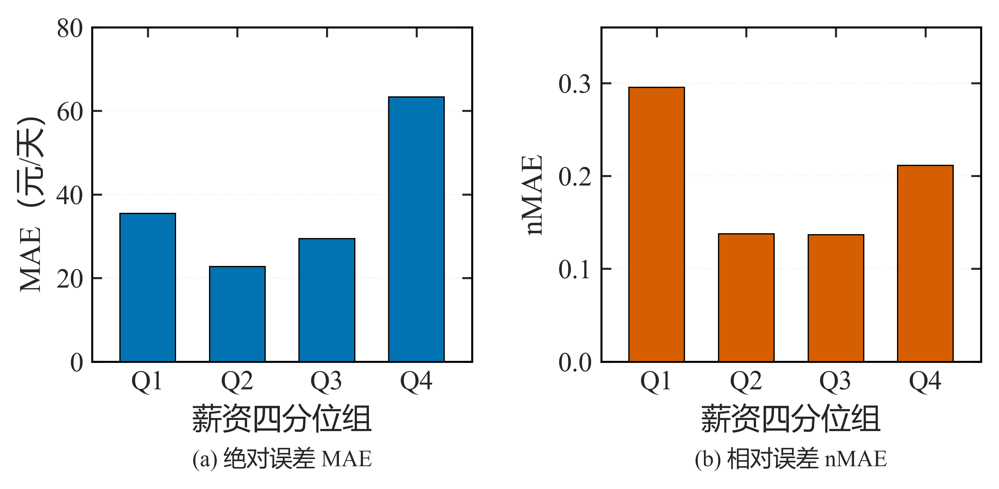
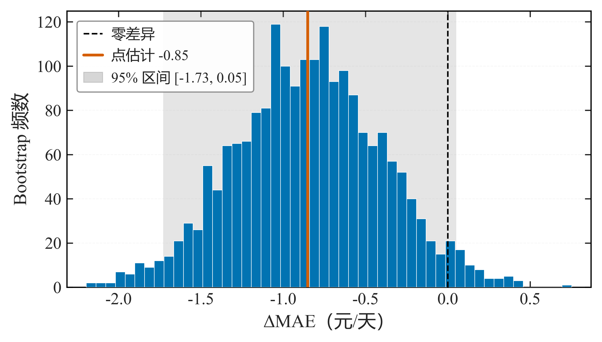
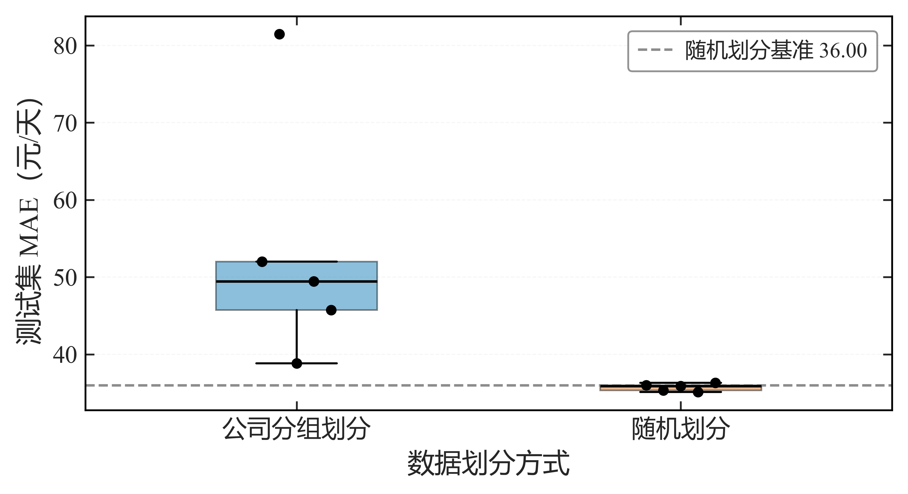
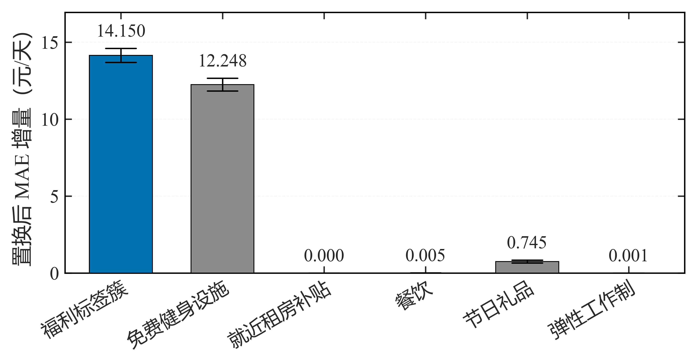
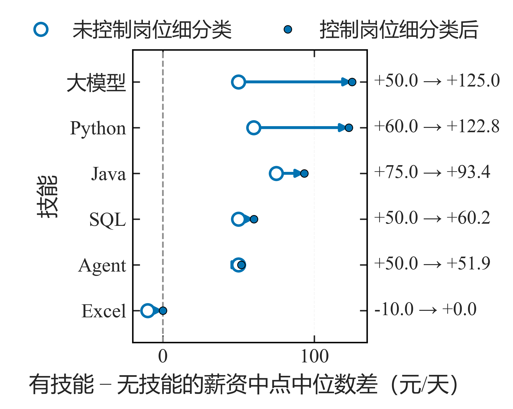
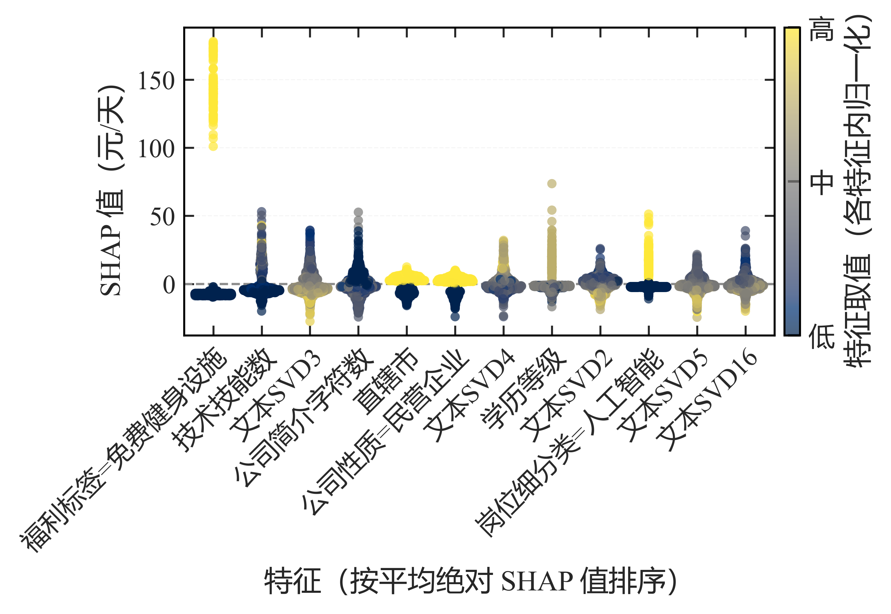

# 第 8 篇 · 机器学习建模与实验评估：建模流程与对照实验

建模流程的组织方式决定评估结果是否可信，实验阶段则需回答模型之间差异是否稳定、各组特征贡献如何。本节将建模与其后的实验评估合并说明，先给出建模流程，再说明多模型对比、区间估计、消融与稳健性检验。

一个完整的建模过程通常包含以下步骤：将数据划分为训练集、验证集与测试集；在训练集上估计预处理参数；用验证集完成模型与超参数的选择；在配置确定后于训练集与验证集上重新拟合；最后在测试集上评估一次。三者的职责分工明确：训练集用于估计参数，验证集用于比较与选择，测试集仅用于最终评估。若测试集被反复用于调参，其性质即等同于验证集，据此得到的泛化估计会偏乐观。

流程确定之后，实验阶段需要回答的问题是：在给定数据与特征下，哪些模型表现较好、差异是否稳定，以及各组特征对预测贡献的大小。回答这些问题要求实验中被测变量之外的条件保持一致，并对差异给出区间估计。本节按此顺序展开，并给出项目中的实际结果。实现基于 scikit-learn 1.3+ 与 NumPy 1.26+；梯度提升模型可选 LightGBM 4.0+ 或 CatBoost 1.2+，特征贡献分析使用 SHAP 0.44+（可选）；运行环境为 Python 3.10+、pandas 2.0+。

---


## 1 数据划分

划分方式取决于数据结构，而非固定使用同一函数：

| 场景 | 方法 |
| --- | --- |
| 一般情况 | `train_test_split`（分层） |
| **同组样本不可跨折** | `GroupShuffleSplit / GroupKFold` |
| 时间序列 | 时间划分（前段训练、后段测试，不打乱） |

```python
from sklearn.model_selection import GroupShuffleSplit

tr, te = next(GroupShuffleSplit(test_size=0.2, random_state=42)
              .split(X, y, groups=df["company_id"]))
```

当同一公司（`company_id`）的岗位同时出现在训练集与测试集时，模型可在训练阶段"记住"该公司特征，从而高估泛化能力，这类情形称为分组泄漏，需按组划分予以避免。时间序列数据同理：若随机打乱，训练数据中将包含测试期之后的信息。

---


## 2 预处理管道与目标字段排除

分别对训练集和测试集执行 `fit_transform` 容易造成两处不一致：训练阶段的参数未在推理阶段复用，或测试数据参与了参数估计。`Pipeline` 与 `ColumnTransformer` 将预处理与模型组合为单一对象，`fit` 仅在训练集上估计参数，推理时自动复用：

```python
from sklearn.pipeline import Pipeline
from sklearn.compose import ColumnTransformer
from sklearn.preprocessing import OneHotEncoder, StandardScaler
from sklearn.impute import SimpleImputer

def build_pre(num_cols, cat_cols):
    return ColumnTransformer([
        ("num", Pipeline([("imp", SimpleImputer(strategy="median")),
                          ("sc", StandardScaler())]), num_cols),
        ("cat", Pipeline([("imp", SimpleImputer(strategy="most_frequent")),
                          ("oh", OneHotEncoder(handle_unknown="ignore"))]), cat_cols)])
```

`Pipeline.fit(X_train)` 会仅在训练集上拟合填充器、编码器与标准化器，推理时复用同一套参数，从而保证训练与推理口径一致。

若特征中包含由预测目标派生的字段（如薪资区间、平均薪酬），模型可直接利用该信息得到虚高的评估指标，这类问题称为目标泄漏。识别方法采用"显式字段名 + 命名模式"两类规则：

```python
SALARY_DERIVED_BLACKLIST = [schema.SALARY_RAW_FIELD, schema.SALARY_MIN_FIELD,
                            schema.SALARY_MAX_FIELD, schema.SALARY_MID_FIELD]
SALARY_COLUMN_PATTERNS = ["薪资", "薪酬", "工资", "面议", "待遇"]

def salary_derived_columns(columns):
    return sorted({c for c in columns
                   if c in SALARY_DERIVED_BLACKLIST
                   or any(p in str(c) for p in SALARY_COLUMN_PATTERNS)})
```

显式字段名覆盖已知的目标派生列，命名模式用于覆盖后续新增的同义列（如"平均薪酬"），避免依赖人工逐一登记。除结构化字段外，文本特征同样需要处理：预测目标为薪资时，特征文本应使用去除薪资信息的语料版本（详见第 4 篇）。

---


## 3 模型训练与选择

模型类型的选取依任务而定，常见组合如下：

| 任务 | 常用模型 |
| --- | --- |
| 回归 | Ridge / Lasso、随机森林、LightGBM / CatBoost |
| 分类 | 逻辑回归、决策树、随机森林、GBDT |
| 聚类 | KMeans、DBSCAN、层次聚类、AP、MeanShift |
| 降维 | PCA / SVD（仅在训练集拟合） |

模型与超参数的选择在验证集上进行，逐一遍历候选配置并记录验证指标：

```python
best = None
for threshold in [50, 80, 100, len(df) // 200]:
    for dim in [16, 32, 64]:
        mae = fit_and_eval(build_matrix(threshold, dim, fit_on="train"), y_tr, y_va)
        if best is None or mae < best[0]:
            best = (mae, threshold, dim)     # 一切"选择"只看 validation
```

在上述循环中，技能阈值与文本降维维度构成候选集合，`fit_and_eval` 返回验证集 MAE，`best` 记录验证误差最小的配置。验证集可反复使用，但反复择优同样会使其过拟合，因此候选集合应有界。

---


## 4 模型评估

评估指标依任务选取：回归使用 MAE、RMSE 与 R²，分类使用 Accuracy 与 F1，聚类使用轮廓系数。为判断模型是否真正提供了信息，需设置常数基线（如 `DummyRegressor`）作对照：

```python
from sklearn.metrics import mean_absolute_error, r2_score
# 常数基线（DummyRegressor）；主模型需明显优于基线
```

评估报告应包含三部分：主指标、基线对照与子群误差（按分组、时间或薪资分位划分）。仅报告总体 MAE 会掩盖子群差异，模型可能在整体上表现良好，却在某个子群上误差显著偏大。测试集在配置锁定后仅评估一次，最终指标以该次结果为准。

---


## 5 多模型对比

进入实验阶段后，比较模型时除被测变量外，其余条件需保持一致，具体包括四项：同一数据划分、同一特征集合、同一候选超参数网格、同一随机种子。这四项构成模型比较的对照条件，任一项不同，"模型 A 优于 B"的结论都可能来自条件差异而非模型本身：划分不同时，比较对象实际是划分；特征集合或超参网格不同时，差异则可能来自特征或配置。

在统一的划分、特征与超参网格下，对各候选模型分别训练并记录验证集误差：

```python
import numpy as np
from sklearn.dummy import DummyRegressor
from sklearn.linear_model import Ridge
from sklearn.ensemble import RandomForestRegressor, HistGradientBoostingRegressor
from sklearn.metrics import mean_absolute_error

def build_models(seed=42):
    return {"Dummy": DummyRegressor(strategy="mean"),
            "Ridge": Ridge(alpha=1.0, random_state=seed),
            "RF":    RandomForestRegressor(n_estimators=400, random_state=seed, n_jobs=-1),
            "LGBM":  HistGradientBoostingRegressor(max_iter=400, learning_rate=0.05, random_state=seed)}

def compare_models(Xtr, ytr, Xva, yva, seed=42):
    out = {}
    for name, m in build_models(seed).items():
        m.fit(Xtr, ytr); pred = m.predict(Xva)
        out[name] = {"mae": mean_absolute_error(yva, pred), "pred": np.asarray(pred, float)}
    return out
```

其中 `Dummy` 为常数基线，用于判断特征是否提供有效信息：若各模型的验证误差与基线接近，说明特征未带来可辨识的改进。对比在同一份训练集与验证集上进行，各模型的验证 MAE 记录于 `out`，作为后续差异判定的输入。

---


## 6 差异的区间估计：配对 bootstrap

两个模型的验证 MAE 通常并不相同，但点估计的差值不足以判断差异是否稳定。可行做法是对同一批样本上的预测误差作配对 bootstrap：以两个模型绝对误差之差为统计对象，有放回重采样若干次，得到差值的经验分布，并据此构造置信区间：

```python
def paired_bootstrap_mae(y_true, pred_a, pred_b, rounds=2000, seed=42):
    rng = np.random.default_rng(seed); y = np.asarray(y_true, float)
    ea = np.abs(y - np.asarray(pred_a, float))
    eb = np.abs(y - np.asarray(pred_b, float))
    diff = eb - ea                                  # >0 表示 b 更差
    n = len(y)
    boot = np.array([diff[rng.integers(0, n, n)].mean() for _ in range(rounds)])
    lo, hi = np.percentile(boot, [2.5, 97.5])
    return {"mean_diff": float(diff.mean()), "ci95": (float(lo), float(hi)),
            "significant": (lo > 0) or (hi < 0)}
```

函数以 `diff = eb - ea` 为统计量，取 2.5% 与 97.5% 分位点作为 95% 区间。区间不包含 0 时，差异方向稳定；区间包含 0 时，两个模型在当前样本规模下的差异不可区分，应在结果中据实报告，不对优劣作判断。

---


## 7 双向消融实验

评估某个特征组的贡献时，若仅从完整模型中移除该组，会高估其作用，原因是移除任意特征都会引起误差上升。因此消融在两个方向进行：既考察移除该组后的变化，也考察仅加入该组后的变化。项目中的特征组划分如下：

| 组 | 特征 |
| --- | --- |
| Base | A 岗位 + B 地域 + C 公司 |
| Base + Skill | 加入 D 技能 |
| Full - Skill | Full 去掉 D |
| Full | A+B+C+D+E |

```python
def ablation(assembler_factory, frame, labels, seed=42):
    out = {}
    for name, grp in [("Base", ["A","B","C"]), ("Base+Skill", ["A","B","C","D"]),
                      ("Full-Skill", ["A","B","C","E"]), ("Full", ["A","B","C","D","E"])]:
        _, pred = assembler_factory(grp, frame, labels, seed)
        out[name] = {"pred": pred, "mae": mean_absolute_error(labels, pred)}
    return out
```

```text
技能增量 = MAE(Base) - MAE(Base+Skill)
文本增量 = MAE(Base+Skill) - MAE(Full)
技能贡献(加法侧) = MAE(Full-Skill) - MAE(Full)   # 双向归因
```

两个方向反映的信息不同：加法侧给出该特征组的增量贡献，减法侧给出其在完整模型中的边际作用；两者的差异可用于判断该组与其他特征组之间的重叠程度。每组增量同样配配对 bootstrap 区间，用于判断贡献是否稳定。

---


## 8 稳健性与泛化实验

稳健性考察结论在数据处理与随机性变化下是否保持，泛化考察模型在跨组、跨时间划分下的表现：

```python
def winsorize(y, p=0.01): return np.clip(y, np.quantile(y, p), np.quantile(y, 1 - p))

for seed in (42, 52, 62, 72, 82):   # 多种子：结论方向应一致
    ...

from sklearn.model_selection import GroupShuffleSplit   # 按公司分组划分，检验泛化
```

稳健性方面，对目标作缩尾、更换目标形式（如薪资中点改为分位数）、更换随机种子，观察结论方向是否一致；泛化方面，分别采用随机划分、公司分组划分与时间划分，比较测试误差。若分组划分的误差明显高于随机划分，说明模型在一定程度上依赖了公司层面的信息。

---


## 9 特征贡献分析

特征贡献使用 TreeSHAP，输出各特征在模型内部的贡献方向与强度：

```python
contrib = model.predict(X, pred_contrib=True)   # LightGBM 原生 SHAP
```

SHAP 值的适用边界有三点：一是贡献值反映模型内部的统计关联，不构成因果关系；二是解释结果不应用于反向修改特征集合或词典，否则解释数据与评估数据混用会引入泄漏；三是贡献较高的低频技能应单独标注，其贡献可能来自少数样本。

---


## 10 项目结果

### 10.1 预测与误差

**图 1** 为正式主模型在测试集上的预测值与真实值对照：

```python
# 来源：scripts/supplementary/01_completion_supplement.py
# 函数 task2_actual_vs_predicted：仅按 Stage26.4 正式统计范围复现已锁定的 LightGBM 最终模型
model_frame = polish.io_utils.read_parquet(polish.project_paths.JOB_SALARY_MODEL_DATASET_PARQUET)
membership = polish.io_utils.read_parquet(polish.project_paths.JOB_SKILL_MEMBERSHIP_PARQUET)
manifest = json.loads((polish.project_paths.SALARY_MODEL_DIR /
                       'feature_manifest.json').read_text(encoding='utf-8'))
grouped = polish.drop_features(
    polish.grouped_columns(manifest, model_frame,
                           polish.SAFE_F_STAGE26_1, polish.SAFE_F_FINAL),
    polish.REMOVED_FINAL)
skill_map = model_training.build_skill_map(membership, skill_eda.ALL_USABLE_SCOPES)
ids = model_frame[schema.ID_FIELD].tolist()
text_matrix = model_training.load_text_matrix(
    ids, polish.project_paths.FEATURES_DIR / 'job_text_embeddings.npz',
    polish.project_paths.FEATURES_DIR / 'job_text_embedding_index.parquet')
text_by_id = {job_id: position for position, job_id in enumerate(ids)}
splits = pd.read_parquet(project_paths.MODEL_SPLITS_PARQUET)
labels = splits.set_index(schema.ID_FIELD)['split']

split_series = labels.reindex(model_frame[schema.ID_FIELD]).to_numpy()
is_test = split_series == 'test'
test_frame = model_frame.loc[is_test].reset_index(drop=True)
fit_frame = model_frame.loc[~is_test].reset_index(drop=True)
text_for = lambda block: text_matrix[[text_by_id[j] for j in block[schema.ID_FIELD]]]
y_fit = fit_frame[schema.SALARY_MID_FIELD].to_numpy('float64')
y_test = test_frame[schema.SALARY_MID_FIELD].to_numpy('float64')

# 预处理器与估计器均在 train + validation 上重拟合，测试集不参与任何拟合或选择
assembler = polish.build_assembler(polish.MODEL_FEATURE_GROUPS, grouped,
                                   SKILL_THRESHOLD, TEXT_DIM)
assembler.fit(fit_frame, skill_map, text_for(fit_frame))
matrix_fit = assembler.transform(fit_frame, skill_map, text_for(fit_frame))
matrix_test = assembler.transform(test_frame, skill_map, text_for(test_frame))
model = model_training.make_model('LightGBM', polish.LIGHTGBM_PARAMS, random_state=SEED)
model.fit(matrix_fit, y_fit)
y_pred = np.asarray(model.predict(matrix_test), dtype='float64')

import matplotlib.pyplot as plt
from matplotlib import colors as mcolors

fig, ax = plt.subplots(figsize=(6.4, 5.8))
# 计数常落在 1~个位数，线性色标会整体发白；改用对数色标并显式给定刻度
hb = ax.hexbin(y_test, y_pred, gridsize=36, cmap='viridis', mincnt=1,
               linewidths=0.15, edgecolors='none')
counts = np.asarray(hb.get_array(), dtype='float64')
max_count = int(np.nanmax(counts)) if np.isfinite(counts).any() else 1
hb.set_norm(mcolors.LogNorm(vmin=1.0, vmax=float(max(max_count, 2))))
low = float(min(y_test.min(), y_pred.min()))
high = float(max(y_test.max(), y_pred.max()))
pad = (high - low) * 0.03
lo, hi = low - pad, high + pad
ax.plot([lo, hi], [lo, hi], linestyle='--', linewidth=1.0,
        color=plot_style.ACCENT_COLOR, zorder=3)
ax.text(lo + (hi - lo) * 0.72, lo + (hi - lo) * 0.78, 'y = x',
        color=plot_style.ACCENT_COLOR, fontsize=plot_style.FONT_SIZES['annotation'],
        ha='left', va='bottom', zorder=4)
ax.set_xlim(lo, hi)
ax.set_ylim(lo, hi)
ax.set_aspect('equal')
ax.set_xlabel('真实薪资中点（元/天）')
ax.set_ylabel('预测薪资中点（元/天）')
plot_style.apply_sci_axis(ax, grid_axis='both')
candidates = [1, 2, 3, 5, 10, 20, 30, 50, 100, 200, 300, 500]
ticks = [value for value in candidates if value <= max_count] or [max_count]
bar = fig.colorbar(hb, ax=ax, fraction=0.046, pad=0.03, ticks=ticks)
bar.set_label('岗位数（对数刻度）', fontsize=plot_style.FONT_SIZES['axis_label'])
bar.ax.set_yticklabels([str(value) for value in ticks])
bar.ax.tick_params(labelsize=plot_style.FONT_SIZES['tick'])
plot_style.add_bottom_caption(
    fig, '最终主模型在测试集上的真实薪资中点与预测薪资中点对照')
for suffix in ('png', 'pdf'):
    fig.savefig(FIGURES_CH7 / ('fig_7_actual_vs_predicted_salary.%s' % suffix),
                dpi=plot_style.PNG_DPI, bbox_inches='tight', facecolor='white')
plt.close(fig)
```


散点越贴近对角线表示预测越准确。薪资分布右偏，高薪段的散点明显分散，这与该区间样本量较少、薪资区间较宽有关，属于数据本身的分布特征。

**图 2** 按薪资四分位给出测试集的绝对误差与相对误差：

```python
# 来源：scripts/figures/ch7/01_quartile_error.py
STEM = 'fig_7_8_error_by_salary_quartile'
CSV = project_paths.RESULTS_E1_E3_E4_E5 / 'test_error_by_salary_quartile.csv'
FIGDIR = project_paths.FIGURES_DIR
CAPTIONS = [('a', '绝对误差 MAE'), ('b', '相对误差 nMAE')]
PRINT_WIDTH_CM, PRINT_HEIGHT_CM = 15.5, 7.4
CM = 1.0 / 2.54
FONT_SCALE = 11.0 / 12.0
FONTS = {'axis_label': 12.0, 'tick': 11.0, 'legend': 11.0, 'annotation': 10.5}


def _w(width_cm: float) -> float:
    return width_cm * CM * FONT_SCALE


def load_quartiles() -> pd.DataFrame:
    """读四分位分组误差（总体行不进入柱图）。"""
    frame = pd.read_csv(CSV)
    return frame[~frame['分组'].str.startswith('总体')].reset_index(drop=True)


def build_figure(body: pd.DataFrame):
    """1×2 柱图：左 MAE、右 nMAE，统一色板与论文版坐标区规范。"""
    height = PRINT_HEIGHT_CM / PRINT_WIDTH_CM * _w(PRINT_WIDTH_CM)
    fig, axes = plt.subplots(1, 2, figsize=(_w(PRINT_WIDTH_CM), height))

    positions = np.arange(len(body), dtype='float64')
    panels = [('MAE（元/天）', 'MAE', plot_style.MAIN_COLOR, np.arange(0.0, 80.1, 20.0), 80.0),
              # (b) 轴名简写为 nMAE，统计范围见子图名与载体正文
              ('nMAE', 'nMAE', plot_style.ACCENT_COLOR, np.arange(0.0, 0.31, 0.1), 0.36)]
    for ax, (ylabel, column, color, ticks, top) in zip(axes, panels):
        values = body[column].to_numpy('float64')
        ax.bar(positions, values, width=0.62, color=color, edgecolor='black', linewidth=0.5,
               zorder=3)
        ax.set_xticks(positions)
        ax.set_xticklabels(['Q1', 'Q2', 'Q3', 'Q4'])
        ax.set_xlim(-0.62, len(body) - 0.38)
        # 显式给定上限与刻度，留出柱顶余量又不产生空刻度
        ax.set_yticks(ticks)
        ax.set_ylim(0.0, top)
        ax.set_xlabel('薪资四分位组', fontsize=FONTS['axis_label'])
        ax.set_ylabel(ylabel, fontsize=FONTS['axis_label'])
        plot_style.apply_sci_axis(ax, grid_axis='y')
    fig.subplots_adjust(left=0.102, right=0.985, bottom=0.26, top=0.955, wspace=0.34)
    return fig, axes


def add_subcaptions(fig, axes) -> None:
    """(a)(b) 子图名置于「横轴刻度标签与横轴名」下沿之下。"""
    fig.canvas.draw()
    renderer = fig.canvas.get_renderer()
    for ax, (letter, text) in zip(axes, CAPTIONS):
        box = ax.get_window_extent(renderer)
        bottom = box.y0
        for artist in [ax.xaxis.label, *ax.get_xticklabels()]:
            try:
                artist_box = artist.get_window_extent(renderer)
            except Exception:                                     # noqa: BLE001
                continue
            bottom = min(bottom, artist_box.y0)
        y = -((box.y0 - bottom) + 8.0) / max(box.height, 1.0)
        plot_style.add_subfigure_caption(ax, letter, text, y=y)


plot_style.setup_sci_style()
plot_style.FONT_SIZES.update(FONTS)
plt.rcParams.update({'axes.labelsize': FONTS['axis_label'],
                     'xtick.labelsize': FONTS['tick'],
                     'ytick.labelsize': FONTS['tick']})

body = load_quartiles()
fig, axes = build_figure(body)
add_subcaptions(fig, axes)
figure_finalize.save_paper_figure(
    fig, FIGDIR, STEM,
    subfigures=[(letter, text, ax) for (letter, text), ax in zip(CAPTIONS, axes)])
```



结果显示误差随薪资分位上升而增大：低分位组的绝对误差较小，高分位组显著增大，而相对误差的变化相对平缓。这说明模型在高薪样本上的预测能力有限，该结论应在结果中如实说明，而不能仅以总体 MAE 概括。

**图 3** 为 LightGBM 与 CatBoost 在测试集上的配对 MAE 差异分布：

```python
# 来源：scripts/figures/ch7/02_model_comparison_bootstrap.py
STEM = 'fig_8_5_lgbm_catboost_paired_difference'
SUMMARY_CSV = project_paths.RESULTS_E1_E3_E4_E5 / 'model_comparison_paired_bootstrap.csv'
DRAWS_CSV = project_paths.RESULTS_E3_E4_E5_BOOTSTRAP / 'model_comparison_paired_bootstrap_draws.csv'
PRINT_WIDTH_CM, PRINT_HEIGHT_CM = 15.5, 8.6
CM = 1.0 / 2.54
FONT_SCALE = 11.0 / 12.0
FONTS = {'axis_label': 12.0, 'tick': 11.0, 'legend': 9.5, 'annotation': 10.5}
BINS = 50
LEGEND_LOC = 'upper left'


def _w(width_cm: float) -> float:
    return width_cm * CM * FONT_SCALE


def _load_script(stem: str):
    spec = importlib.util.spec_from_file_location(
        's_' + stem, str(project_paths.SCRIPTS_DIR / 'experiments' / stem))
    module = importlib.util.module_from_spec(spec)
    sys.modules['s_' + stem] = module
    spec.loader.exec_module(module)
    return module


def compute_draws() -> np.ndarray:
    """按 experiments/01_E1_E3_E4_E5_model E1 段的同一路径重算 2,000 次配对 bootstrap 抽样。"""
    exp = _load_script('01_E1_E3_E4_E5_model.py')
    polish = exp.load_polish()

    model_frame = polish.io_utils.read_parquet(polish.project_paths.JOB_SALARY_MODEL_DATASET_PARQUET)
    membership = polish.io_utils.read_parquet(polish.project_paths.JOB_SKILL_MEMBERSHIP_PARQUET)
    manifest = json.loads((polish.project_paths.SALARY_MODEL_DIR /
                           'feature_manifest.json').read_text(encoding='utf-8'))
    grouped = polish.drop_features(
        polish.grouped_columns(manifest, model_frame,
                               polish.SAFE_F_STAGE26_1, polish.SAFE_F_FINAL),
        polish.REMOVED_FINAL)
    skill_map = model_training.build_skill_map(membership, skill_eda.ALL_USABLE_SCOPES)
    ids = model_frame[schema.ID_FIELD].tolist()
    text_matrix = model_training.load_text_matrix(
        ids, polish.project_paths.FEATURES_DIR / 'job_text_embeddings.npz',
        polish.project_paths.FEATURES_DIR / 'job_text_embedding_index.parquet')
    text_by_id = {job_id: position for position, job_id in enumerate(ids)}
    splits = pd.read_parquet(project_paths.MODEL_SPLITS_PARQUET)
    labels = splits.set_index(schema.ID_FIELD)['split']
    split_series = labels.reindex(model_frame[schema.ID_FIELD]).to_numpy()
    is_test = split_series == 'test'
    test_frame = model_frame.loc[is_test].reset_index(drop=True)
    fit_frame = model_frame.loc[~is_test].reset_index(drop=True)
    text_for = lambda block: text_matrix[[text_by_id[j] for j in block[schema.ID_FIELD]]]
    y_test = test_frame[schema.SALARY_MID_FIELD].to_numpy('float64')
    y_fit = fit_frame[schema.SALARY_MID_FIELD].to_numpy('float64')

    assembler = polish.build_assembler(polish.MODEL_FEATURE_GROUPS, grouped,
                                       exp.SKILL_THRESHOLD, exp.TEXT_DIM)
    assembler.fit(fit_frame, skill_map, text_for(fit_frame))
    matrix_fit = assembler.transform(fit_frame, skill_map, text_for(fit_frame))
    matrix_test = assembler.transform(test_frame, skill_map, text_for(test_frame))

    predictions = {}
    for key, params in [('LightGBM', polish.LIGHTGBM_PARAMS), ('CatBoost', polish.CATBOOST_PARAMS)]:
        model = model_training.make_model(key, params, random_state=exp.SEED)
        if key == 'CatBoost':
            model.set_params(verbose=0)
        model.fit(matrix_fit, y_fit)
        predictions[key] = np.asarray(model.predict(matrix_test), dtype='float64')

    # 配对统计量：两模型绝对误差之差（LightGBM − CatBoost）
    error_diff = (np.abs(y_test - predictions['LightGBM']) - np.abs(y_test - predictions['CatBoost']))
    rng = np.random.default_rng(exp.SEED)
    draws = np.array([error_diff[rng.integers(0, len(error_diff), len(error_diff))].mean()
                      for _ in range(exp.BOOTSTRAP_ROUNDS)], dtype='float64')
    return draws


def build_figure(draws: np.ndarray, summary: pd.Series):
    """Bootstrap 分布直方图 ＋ 95% 区间底纹 ＋ 右上角图例（零线/点估计/区间）。"""
    delta = float(summary['ΔMAE（LightGBM − CatBoost）'])
    low, high = float(summary['ΔMAE 95% CI 下界']), float(summary['ΔMAE 95% CI 上界'])

    fig, ax = plt.subplots(figsize=(_w(PRINT_WIDTH_CM),
                                    PRINT_HEIGHT_CM / PRINT_WIDTH_CM * _w(PRINT_WIDTH_CM)))
    ax.hist(draws, bins=BINS, color=plot_style.MAIN_COLOR, edgecolor='white', linewidth=0.35,
            zorder=3)
    # 底纹用 fill_between：门禁的图例重叠率只统计数据图元，底纹不计入，图例可直接压上
    ax.fill_between([low, high], 0.0, 1.0, transform=ax.get_xaxis_transform(),
                    color=plot_style.MUTED_COLOR, alpha=0.22, linewidth=0.0, zorder=1)
    ax.axvline(0.0, color='black', linewidth=1.0, linestyle='--', zorder=4)
    ax.axvline(delta, color=plot_style.ACCENT_COLOR, linewidth=1.8, zorder=5)
    ax.set_xlabel('ΔMAE（元/天）', fontsize=FONTS['axis_label'])
    ax.set_ylabel('Bootstrap 频数', fontsize=FONTS['axis_label'])
    handles = [plt.Line2D([], [], color='black', linewidth=1.0, linestyle='--'),
               plt.Line2D([], [], color=plot_style.ACCENT_COLOR, linewidth=1.8),
               plt.Rectangle((0, 0), 1, 1, facecolor=plot_style.MUTED_COLOR, alpha=0.35,
                             edgecolor=plot_style.MUTED_COLOR, linewidth=0.6)]
    # 横向只留极小边距，图例直接压在区间底纹上
    span = max(float(draws.max()) - float(draws.min()), 1e-9)
    ax.set_xlim(float(draws.min()) - 0.04 * span, float(draws.max()) + 0.04 * span)
    # 图例只留必要信息，白底描边压住底纹，样块缩短并与绘制元素对应
    ax.legend(handles,
              ['零差异', '点估计 %.2f' % delta, '95%% 区间 [%.2f, %.2f]' % (low, high)],
              loc=LEGEND_LOC, frameon=True, framealpha=0.94, facecolor='white',
              edgecolor='#8C8C8C', fancybox=True, fontsize=FONTS['legend'],
              handlelength=1.3, handletextpad=0.6, borderpad=0.45, labelspacing=0.5,
              borderaxespad=0.7)
    plot_style.apply_sci_axis(ax, grid_axis='y')
    fig.subplots_adjust(left=0.135, right=0.985, bottom=0.145, top=0.955)
    return fig, ax


plot_style.setup_sci_style()
plot_style.FONT_SIZES.update(FONTS)
plt.rcParams.update({'axes.labelsize': FONTS['axis_label'],
                     'xtick.labelsize': FONTS['tick'],
                     'ytick.labelsize': FONTS['tick']})

summary = pd.read_csv(SUMMARY_CSV).iloc[0]   # 冻结汇总统计（ΔMAE 与 95% 区间）
draws = compute_draws()
fig, ax = build_figure(draws, summary)
figure_finalize.save_paper_figure(fig, project_paths.FIGURES_DIR, STEM, subfigures=[])
```



图中 ΔMAE 的 95% 区间约为 **[−1.73, +0.05]**，跨越 0，说明两个模型在该样本规模下的差异不可区分，未对优劣作判断。

### 10.2 稳健性与特征贡献

**图 4** 为同一主模型在重复的公司分组划分下的测试集 MAE 分布：

```python
# 来源：scripts/figures/ch8/01_company_split_boxplot.py
STEM = 'fig_8_6_company_split_mae_distribution'
REPEATS_CSV = project_paths.RESULTS_E2_E7 / 'company_group_split_repeats.csv'
SUMMARY_CSV = project_paths.RESULTS_E2_E7 / 'company_group_split_summary.csv'
METRICS_XLSX = project_paths.TABLES_DIR / 'ch7/52_stage26_4_metrics_final.xlsx'
PRINT_WIDTH_CM, PRINT_HEIGHT_CM = 15.5, 8.2
CM = 1.0 / 2.54
FONT_SCALE = 11.0 / 12.0
FONTS = {'axis_label': 12.0, 'tick': 11.0, 'legend': 9.5, 'annotation': 10.5}
CATEGORIES = ['公司分组划分', '随机划分']


def _w(width_cm: float) -> float:
    return width_cm * CM * FONT_SCALE


def load_data() -> tuple[np.ndarray, np.ndarray, float]:
    """读两类划分的测试集 MAE 与基准线取值。"""
    company = pd.read_csv(REPEATS_CSV)['test MAE'].to_numpy('float64')
    summary = pd.read_csv(SUMMARY_CSV).set_index('指标')['取值']
    baseline = float(summary.loc['随机划分同统计范围 MAE 基准'])
    seeds = pd.read_excel(METRICS_XLSX, sheet_name='08_多种子明细')
    random_mae = seeds[seeds['模型'] == 'LightGBM']['test MAE'].to_numpy('float64')
    return company, random_mae, baseline


def build_figure(company: np.ndarray, random_mae: np.ndarray, baseline: float):
    """箱线图 ＋ 全量散点 ＋ 基准线（仅基准线进图例，箱体含义由横轴刻度承担）。"""
    fig, ax = plt.subplots(figsize=(_w(PRINT_WIDTH_CM),
                                    PRINT_HEIGHT_CM / PRINT_WIDTH_CM * _w(PRINT_WIDTH_CM)))
    box = ax.boxplot([company, random_mae], widths=0.42, patch_artist=True,
                     tick_labels=CATEGORIES, showfliers=False,
                     medianprops={'color': 'black', 'linewidth': 1.1},
                     boxprops={'edgecolor': 'black', 'linewidth': 0.7},
                     whiskerprops={'color': 'black', 'linewidth': 0.9},
                     capprops={'color': 'black', 'linewidth': 0.9})
    for patch, color in zip(box['boxes'], [plot_style.MAIN_COLOR, plot_style.ACCENT_COLOR]):
        patch.set_facecolor(color)
        patch.set_alpha(0.45)
    for index, values in enumerate([company, random_mae], start=1):
        jitter = np.linspace(-0.09, 0.09, len(values))
        ax.scatter(np.full(len(values), index, dtype='float64') + jitter, values, s=22,
                   color='black', linewidths=0.0, zorder=3)
    ax.axhline(baseline, color=plot_style.MUTED_COLOR, linestyle='--', linewidth=1.1, zorder=2)
    ax.set_xlabel('数据划分方式', fontsize=FONTS['axis_label'])
    ax.set_ylabel('测试集 MAE（元/天）', fontsize=FONTS['axis_label'])
    ax.set_xlim(0.45, 2.55)
    ax.legend([plt.Line2D([], [], color=plot_style.MUTED_COLOR, linestyle='--', linewidth=1.1)],
              ['随机划分基准 %.2f' % baseline],
              loc='upper right', frameon=True, framealpha=0.94, facecolor='white',
              edgecolor='#8C8C8C', fancybox=True, fontsize=FONTS['legend'],
              handlelength=1.6, handletextpad=0.6, borderpad=0.45, borderaxespad=0.7)
    plot_style.apply_sci_axis(ax, grid_axis='y')
    fig.subplots_adjust(left=0.098, right=0.985, bottom=0.145, top=0.965)
    return fig, ax


plot_style.setup_sci_style()
plot_style.FONT_SIZES.update(FONTS)
plt.rcParams.update({'axes.labelsize': FONTS['axis_label'],
                     'xtick.labelsize': FONTS['tick'],
                     'ytick.labelsize': FONTS['tick']})

company, random_mae, baseline = load_data()
fig, ax = build_figure(company, random_mae, baseline)
figure_finalize.save_paper_figure(fig, project_paths.FIGURES_DIR, STEM, subfigures=[])
```



与随机划分相比，公司分组划分的误差明显更高，说明模型部分依赖了公司层面的信息，随机划分下的指标会高估其跨公司泛化能力。

**图 5** 为福利标签簇整体置换与单标签置换的 MAE 增量对比：

```python
# 来源：scripts/figures/ch8/03_benefit_cluster_permutation.py
STEM = 'fig_8_11_benefit_cluster_permutation'
PERM_CSV = project_paths.RESULTS_E1_E3_E4_E5 / 'benefit_cluster_permutation.csv'
PRINT_WIDTH_CM, PRINT_HEIGHT_CM = 15.5, 7.6
CM = 1.0 / 2.54
FONT_SCALE = 11.0 / 12.0
FONTS = {'axis_label': 12.0, 'tick': 11.0, 'legend': 9.5, 'annotation': 10.5}
CLUSTER_ROW = '福利标签簇（5 列同步置换）'
CLUSTER_TICK = '福利标签簇'        # 刻度标签只用短名，「5 列同步置换」由图例一条说明承担
LABEL_ROTATION = 30.0             # 横轴标签倾角：水平排布时相邻标签会相撞
XLABEL_FONTSIZE = 9.5             # 标签字号：倾角下水平投影需小于列距
CAP_HALF = 0.15                   # 误差线帽的半个宽度（数据单位，柱宽 0.62）


def _w(width_cm: float) -> float:
    return width_cm * CM * FONT_SCALE


def read_permutation() -> pd.DataFrame:
    """读冻结的置换结果（6 行：福利标签簇整体置换 + 5 个单列置换）。"""
    return pd.read_csv(PERM_CSV)


def build_figure(frame: pd.DataFrame):
    """6 根柱：簇用主色、单列用中性灰；误差线为标准差；柱顶标 3 位小数。"""
    labels = [CLUSTER_TICK if name == CLUSTER_ROW else str(name).replace('单列：', '')
              for name in frame['置换对象']]
    values = frame['MAE 增量均值'].to_numpy('float64')
    errors = frame['MAE 增量标准差'].to_numpy('float64')
    colors = [plot_style.MAIN_COLOR] + [plot_style.MUTED_COLOR] * (len(frame) - 1)

    fig, ax = plt.subplots(figsize=(_w(PRINT_WIDTH_CM),
                                    PRINT_HEIGHT_CM / PRINT_WIDTH_CM * _w(PRINT_WIDTH_CM)))
    positions = np.arange(len(frame), dtype='float64')
    ax.bar(positions, values, width=0.62, color=colors, edgecolor='black', linewidth=0.5,
           zorder=3)
    # 误差线逐柱单独画：bar(yerr=...) 会把帽线合并成跨全宽的 Line2D，导致重叠率门禁误报
    for position, value, error in zip(positions, values, errors):
        ax.plot([position, position], [value - error, value + error], color='black',
                linewidth=0.8, zorder=4)
        for edge in (value - error, value + error):
            ax.plot([position - CAP_HALF, position + CAP_HALF], [edge, edge],
                    color='black', linewidth=0.8, zorder=4)

    top = float(np.max(values + errors))
    pad = 0.035 * top
    for position, (value, error) in enumerate(zip(values, errors)):
        ax.text(position, value + error + pad, '%.3f' % value, ha='center', va='bottom',
                fontsize=FONTS['annotation'], zorder=4)

    ax.set_xticks(positions)
    ax.set_xticklabels(labels, rotation=LABEL_ROTATION, rotation_mode='anchor',
                       ha='right', va='top', fontsize=XLABEL_FONTSIZE)
    ax.set_xlim(-0.55, len(frame) - 0.45)
    ax.set_ylim(0.0, top * 1.16)
    # 横轴名与整条图例按用户要求删除：含义由 6 个刻度标签与载体文档承担
    ax.set_ylabel('置换后 MAE 增量（元/天）', fontsize=FONTS['axis_label'])
    plot_style.apply_sci_axis(ax, grid_axis='y')
    fig.subplots_adjust(left=0.10, right=0.995, bottom=0.19, top=0.96)
    return fig, ax


plot_style.setup_sci_style()
plot_style.FONT_SIZES.update(FONTS)
plt.rcParams.update({'axes.labelsize': FONTS['axis_label'],
                     'xtick.labelsize': FONTS['tick'],
                     'ytick.labelsize': FONTS['tick']})

frame = read_permutation()
fig, ax = build_figure(frame)
figure_finalize.save_paper_figure(fig, project_paths.FIGURES_DIR, STEM, subfigures=[])
```



整体置换未产生显著大于单标签置换的增量，说明该标签簇的贡献并不集中，单独解读其中某个标签的贡献时需谨慎。

**图 6** 为技能与薪资的差异在控制岗位细分类前后的变化：

```python
# 来源：scripts/figures/ch6/02_skill_control_dumbbell.py
STEM = 'fig_6_4_skill_salary_control_dumbbell'
TABLE29 = project_paths.TABLES_DIR / 'ch4/21_eda_statistical_analysis.xlsx'
OUT_DIR = project_paths.FIGURES_DIR / 'supplementary'
# docx 侧图 6-3 不在 FIG_WIDTH_CM 名单，按默认 10.5 cm 插入
PRINT_WIDTH_CM, PRINT_HEIGHT_CM = 10.5, 8.6
CM = 1.0 / 2.54
FONT_SCALE = 11.0 / 12.0
FONTS = {'axis_label': 12.0, 'tick': 11.0, 'legend': 11.0, 'annotation': 10.5}


def _w(width_cm: float) -> float:
    return width_cm * CM * FONT_SCALE


def load_differences() -> pd.DataFrame:
    """读两类统计范围的中位数差：控制后按「细分类内有技能岗位数」加权平均。"""
    overall = pd.read_excel(TABLE29, sheet_name='08_技能薪资').set_index('技能标准名')
    within = pd.read_excel(TABLE29, sheet_name='09_岗位内技能薪资')
    rows = []
    for skill in dict.fromkeys(within['技能标准名'].tolist()):
        block = within[within['技能标准名'] == skill]
        after = float(np.average(block['中位数差'].to_numpy('float64'),
                                 weights=block['有技能岗位数'].to_numpy('float64')))
        before = float(overall.loc[skill, '中位数差'])
        rows.append({'技能': skill, '未控制': before, '控制后': after})
    frame = pd.DataFrame(rows)
    return frame.sort_values('控制后', ascending=False).reset_index(drop=True)


def build_figure(frame: pd.DataFrame):
    """哑铃箭头图：空心点＝未控制，实心点＝控制后，右端给出两类读数。"""
    height = PRINT_HEIGHT_CM / PRINT_WIDTH_CM * _w(PRINT_WIDTH_CM)
    fig, ax = plt.subplots(figsize=(_w(PRINT_WIDTH_CM), height))

    y = np.arange(len(frame), dtype='float64')
    for row, (_, item) in zip(y, frame.iterrows()):
        before, after = float(item['未控制']), float(item['控制后'])
        ax.annotate('', xy=(after, row), xytext=(before, row),
                    arrowprops={'arrowstyle': '-|>', 'color': plot_style.MAIN_COLOR,
                                'linewidth': 1.6, 'shrinkA': 0.0, 'shrinkB': 0.0},
                    zorder=3)
        ax.plot([before], [row], marker='o', markersize=7.0, markerfacecolor='white',
                markeredgecolor=plot_style.MAIN_COLOR, markeredgewidth=1.4, zorder=4)
        # 控制后用小实心点：变化极小的行两点几乎重合，小点嵌在大空心环里仍能看出「几乎没变」
        ax.plot([after], [row], marker='o', markersize=4.2, color=plot_style.MAIN_COLOR,
                markeredgecolor='black', markeredgewidth=0.45, zorder=5)
        # 右端数值列：两类读数统一 1 位小数，列对齐在坐标区之外
        ax.text(1.03, row, '%+.1f → %+.1f' % (before, after), transform=ax.get_yaxis_transform(),
                va='center', ha='left', fontsize=FONTS['annotation'], clip_on=False)

    ax.axvline(0, color=plot_style.MUTED_COLOR, linestyle='--', linewidth=0.9, zorder=2)
    ax.set_yticks(y)
    ax.set_yticklabels(frame['技能'].tolist())
    ax.set_xlim(-20, 135)
    ax.set_ylim(-0.7, len(frame) - 0.3)
    ax.invert_yaxis()
    ax.set_xlabel('有技能 − 无技能的薪资中点中位数差（元/天）', fontsize=FONTS['axis_label'])
    ax.set_ylabel('技能', fontsize=FONTS['axis_label'])
    plot_style.apply_sci_axis(ax, grid_axis='x')
    handles = [plt.Line2D([], [], marker='o', linestyle='none', markersize=7.0,
                          markerfacecolor='white', markeredgecolor=plot_style.MAIN_COLOR,
                          markeredgewidth=1.4),
               plt.Line2D([], [], marker='o', linestyle='none', markersize=4.2,
                          color=plot_style.MAIN_COLOR, markeredgecolor='black',
                          markeredgewidth=0.45)]
    ax.legend(handles, ['未控制岗位细分类', '控制岗位细分类后'],
              loc='lower center', bbox_to_anchor=(0.5, 1.005), ncol=2, frameon=False,
              fontsize=FONTS['legend'], columnspacing=1.8, handletextpad=0.6,
              borderaxespad=0.0)
    fig.subplots_adjust(left=0.245, right=0.72, bottom=0.135, top=0.86)
    return fig, frame


plot_style.setup_sci_style()
plot_style.FONT_SIZES.update(FONTS)
plt.rcParams.update({'axes.labelsize': FONTS['axis_label'],
                     'xtick.labelsize': FONTS['tick'],
                     'ytick.labelsize': FONTS['tick']})

frame = load_differences()
fig, _ = build_figure(frame)
figure_finalize.save_paper_figure(fig, OUT_DIR, STEM, subfigures=[])
```



不控制岗位类别时，"技能—薪资"关联中的相当部分由岗位类别本身带来，属于伪关联；控制之后，各技能的差异幅度明显收窄。

**图 7** 为正式主模型的 SHAP 蜂群图（Top12 特征）：

```python
# 来源：scripts/figures/ch8/02_shap_beeswarm.py
STEM = 'fig_8_9_shap_beeswarm'
SUPP_DIR = project_paths.FIGURES_DIR / 'supplementary'
PRINT_WIDTH_CM = 12.5                 # 设计宽度 = Word 插入宽度
FIG_HEIGHT_IN = 3.62
CM = 1.0 / 2.54
FONT_SCALE = 11.0 / 12.0
FONTS = {'axis_label': 11.5, 'tick': 10.5, 'legend': 10.0, 'annotation': 10.0}
ADJUST = {'left': 0.115, 'right': 0.880, 'bottom': 0.500, 'top': 0.975}
TOP_N = 12
DOT_SIZE = 14.0
DOT_ALPHA = 0.70
SWARM_HALF_WIDTH = 0.42               # 蜂群在「列间距 = 1」下的最大半宽
N_BINS = 100                          # 密度分层用的 SHAP 邻域分箱数
LAYER_SEED = 42
LABEL_ROTATION = 45.0                 # 横轴特征名倾斜角度（度）
XLABEL = '特征（按平均绝对 SHAP 值排序）'
YLABEL = 'SHAP 值（元/天）'
CBAR_LABEL = '特征取值（各特征内归一化）'

# 显示名简写只删冗余限定词与工程后缀
LABEL_ALIASES = {'公司标签列表=免费健身设施': '福利标签=免费健身设施',
                 '是否直辖市': '直辖市',
                 '岗位细分类集合=人工智能': '岗位细分类=人工智能'}


def swarm_offsets(values: np.ndarray) -> np.ndarray:
    """密度分层蜂群：返回每个样本相对「特征列中心线」的左右偏移。

    先按取值分箱，同一箱内的样本交替向两侧堆叠（0, +1, -1, +2, -2, …），
    再整体归一到 ``SWARM_HALF_WIDTH`` 以内，因此某处的横向厚度与该处的局部密度成正比。
    """
    values = np.asarray(values, dtype='float64')
    span = float(values.max() - values.min())
    if span <= 0:
        quant = np.zeros(len(values), dtype='int64')
    else:
        quant = np.round(N_BINS * (values - values.min()) / (span + 1e-8)).astype('int64')
    # 同一取值内的先后次序随机打散（固定种子），使堆叠层号不被原始行序决定
    rng = np.random.default_rng(LAYER_SEED)
    order = np.argsort(quant + rng.normal(0.0, 1e-6, len(values)), kind='stable')

    offsets = np.zeros(len(values), dtype='float64')
    layer = 0
    last_bin = -1
    for index in order:
        if quant[index] != last_bin:
            layer = 0
        offsets[index] = np.ceil(layer / 2.0) * ((layer % 2) * 2 - 1)
        layer += 1
        last_bin = quant[index]
    largest = float(offsets.max())
    if largest <= 0:
        return offsets
    return offsets * (0.9 * SWARM_HALF_WIDTH / (largest + 1.0))


def build_figure(block: dict) -> tuple:
    """整图横置 ＋ 密度分层蜂群：特征排在横轴（倾斜 45°），SHAP 值排在纵轴。"""
    names = block['特征名']
    values = block['测试集SHAP']
    dense = block['测试集矩阵']
    magnitude = np.abs(values).mean(axis=0)
    rank = np.argsort(magnitude)[::-1][:TOP_N]

    fig, ax = plt.subplots(figsize=(PRINT_WIDTH_CM * CM * FONT_SCALE, FIG_HEIGHT_IN))
    scatter = None
    columns = []
    for column_position, feature_index in enumerate(rank):
        shap = values[:, feature_index]
        raw = dense[:, feature_index]
        span = float(raw.max() - raw.min())
        scaled = (raw - raw.min()) / span if span > 0 else np.zeros_like(raw)
        offsets = swarm_offsets(shap)
        scatter = ax.scatter(column_position + offsets, shap, s=DOT_SIZE, c=scaled,
                             cmap='cividis', vmin=0.0, vmax=1.0, alpha=DOT_ALPHA,
                             edgecolor='none', zorder=3)
        columns.append(LABEL_ALIASES.get(str(names[feature_index]),
                                         str(names[feature_index])))

    ax.axhline(0, color=plot_style.MUTED_COLOR, linestyle='--', linewidth=0.9, zorder=1)
    ax.set_xticks(np.arange(len(rank)))
    ax.set_xticklabels(columns, rotation=LABEL_ROTATION,
                       rotation_mode='anchor', ha='right', va='top')
    ax.set_xlim(-0.6, len(rank) - 0.4)
    ax.set_xlabel(XLABEL)
    ax.set_ylabel(YLABEL)
    plot_style.apply_sci_axis(ax, grid_axis='y')
    colorbar = fig.colorbar(scatter, ax=ax, fraction=0.030, pad=0.016,
                            ticks=[0.0, 0.5, 1.0])
    colorbar.set_label(CBAR_LABEL, fontsize=plot_style.FONT_SIZES['axis_label'])
    colorbar.set_ticklabels(['低', '中', '高'])
    fig.subplots_adjust(**ADJUST)
    return fig, ax, columns


plot_style.setup_sci_style()
plot_style.FONT_SIZES.update(FONTS)
plt.rcParams.update({'font.size': FONTS['tick'],
                     'axes.labelsize': FONTS['axis_label'],
                     'xtick.labelsize': FONTS['tick'],
                     'ytick.labelsize': FONTS['tick'],
                     'axes.unicode_minus': False})

# 复用 scripts/ch4_lifecycle/07_figure_rebuild.py 的 build_final_shap()
# （重拟合正式主模型 A+B+C+D+E，重算测试集 TreeSHAP；数值只读）
block = figure_rebuild.build_final_shap()
fig, ax, columns = build_figure(block)
figure_finalize.save_paper_figure(fig, SUPP_DIR, STEM, subfigures=[])
```



每个点表示一个样本，颜色表示特征取值，横/纵位置表示 SHAP 值。该图用于展示哪些特征在推动预测及其方向，其结论限于统计关联，与图 6 的结论一致。

---


## 11 小结

建模的可信度主要取决于流程的组织。数据划分需与数据结构匹配，同源样本应分组划分，时间序列应按时序划分；预处理通过 Pipeline 与模型绑定，参数仅在训练集估计；目标相关字段需在入模前识别并排除。模型与超参数的选择以验证集为依据，测试集仅用于最终评估；评估结果除主指标外，还应包含基线对照与子群误差，以完整反映模型的适用边界。

实验设计的核心在于使比较具备条件一致性与可解释性：多模型对比固定划分、特征、超参网格与随机种子；模型差异通过配对 bootstrap 区间判断，区间跨越 0 时不对优劣作判断；特征贡献通过双向消融评估，并辅以稳健性与泛化实验检验结论的稳定性。特征贡献分析（SHAP）用于解释模型内部的特征作用，其结果反映统计关联，需结合混杂因素控制（如岗位类别）共同解读。

---


## 12 延伸参考

- 相关文章：[逻辑回归分类（LogisticRegression）算法详解](https://blog.csdn.net/MoRanzhi1203/article/details/159410951)、[scikit-learn 决策树分类详解](https://blog.csdn.net/MoRanzhi1203/article/details/159857028)、[随机森林算法详解](https://blog.csdn.net/MoRanzhi1203/article/details/162426179)、[scikit-learn Lasso 回归算法详解](https://blog.csdn.net/MoRanzhi1203/article/details/159683237)、[DBSCAN 密度聚类算法详解](https://blog.csdn.net/MoRanzhi1203/article/details/162729895)；
- scikit-learn 用户指南（Pipeline / ColumnTransformer / model_selection）；配对 bootstrap 与置换检验方法说明；SHAP 与 TreeSHAP 论文；


上一篇：[07 统计分析与推断](./第 7 篇 · 统计分析与推断：非参数检验、效应量与 FDR.md) ｜ 下一篇：[09 数值计算与图像处理](./第 9 篇 · 数值计算与图像处理：NumPy、SciPy、Pillow.md)


